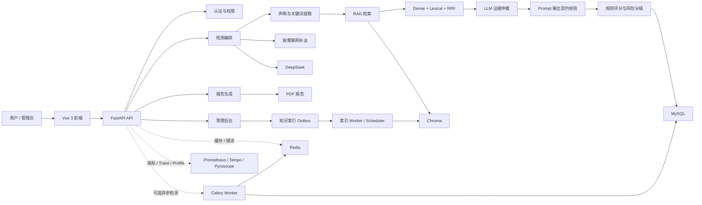

# 智闻辨真：基于 RAG 与大语言模型的新闻可信度评估系统

智闻辨真是一套端到端的新闻可信度评估系统。用户提交新闻标题、正文或链接后，系统通过本地知识库检索与按需联网补证收集证据，调用大语言模型完成证据仲裁，再结合规则评分生成可信度分数、风险等级、判断理由、风险点、相似证据和 PDF 报告。

项目已覆盖用户端、管理后台、离线评测、异步任务、缓存、可观测性和容器化部署，可用于课程答辩、系统演示与工程实践。

## 核心功能

- 用户注册、登录、JWT 鉴权、游客检测和管理员权限控制。
- 新闻标题、正文与链接识别；链接抓取默认拒绝私网地址，降低 SSRF 风险。
- 工程化 RAG：Chroma 向量库、chunk 索引、dense + lexical 混合召回、RRF 融合、父文档聚合、MMR 去重、rerank 与证据压缩。
- 按需联网检索和定时新闻抓取，统一通过知识库索引 outbox/job 流程写入索引。
- DeepSeek 结构化分析、规则评分、四级风险分级和异常降级处理。
- 证据仲裁质量控制：候选证据随机排序、`candidate_id` 约束、后端校验和质量指标。
- 统一 Prompt 输出契约，集中管理字段、别名、风险等级和前后端展示规则。
- 检测历史、结果详情、重新评估、公开高风险新闻和 PDF 报告。
- 管理后台：用户、检测记录、知识库、Prompt、报告、高风险新闻、统计、运行日志和 AI 工程策略管理。
- 可选 Redis 缓存、Celery 异步检测任务、Prometheus 指标、OpenTelemetry 链路追踪和 Pyroscope 持续剖析。
- 可复现离线评测，支持分类、检索、延迟、稳定性、证据完整率与人工评审一致性指标。

## 技术栈

| 层级 | 技术 |
|---|---|
| 后端 | Python 3.12、FastAPI、SQLAlchemy、Pydantic、Alembic、JWT |
| 前端 | Vue 3、Vite、Element Plus、Pinia、Vue Router、ECharts |
| 数据 | MySQL、Chroma、Redis（可选） |
| AI | DeepSeek、DashScope Embedding、Bocha AI 联网检索 |
| 异步任务 | Celery + Redis |
| 报告 | Jinja2、HTML 模板、xhtml2pdf |
| 可观测性 | Prometheus、Grafana、OpenTelemetry、Tempo、Pyroscope、Alertmanager |
| 部署 | Docker Compose、Nginx、Caddy |

## 系统架构



检测链路不是一次模型调用，而是“声明抽取 → RAG 检索 → 必要时联网补证 → 证据仲裁 → 契约校验 → 规则评分 → 结果落库 → 指标与审计”的可观测流水线。知识库写入采用 outbox/job 模式，使自动抓取、管理员导入和索引重建进入同一套同步策略。

## 项目结构

```text
NewsCredibilityEvaluator/
├── backend/                 # FastAPI 后端、迁移和后端测试
│   ├── app/
│   │   ├── api/             # API 路由
│   │   ├── core/            # 配置、安全、缓存和可观测性
│   │   ├── crud/            # 数据库 CRUD
│   │   ├── db/              # 数据库初始化、迁移和演示数据
│   │   ├── models/          # SQLAlchemy 模型
│   │   ├── schemas/         # Pydantic Schema
│   │   ├── services/        # 检测、RAG、LLM、抓取和报告服务
│   │   ├── tasks/           # Celery 任务
│   │   └── templates/       # 报告模板
│   ├── alembic/             # Alembic 迁移
│   └── tests/               # 后端测试
├── frontend/                # Vue 3 前端
│   └── src/
│       ├── api/             # API 封装
│       ├── components/      # 通用组件
│       ├── contracts/       # 前端契约适配
│       ├── layouts/         # 用户端和管理端布局
│       ├── router/          # 路由与权限守卫
│       ├── stores/          # Pinia 状态
│       ├── utils/           # 请求、缓存和图表工具
│       └── views/           # 页面
├── contracts/               # 跨前后端的机器可读契约
├── evaluation/              # 离线评测数据、脚本和测试
├── deploy/                  # Caddy 与可观测性组件配置
├── docs/                    # 设计、开发、审查和发布文档
├── data/                    # 本地 Chroma 与报告目录（默认不提交）
├── docker-compose.yml       # 本地容器化运行
├── docker-compose.prod.yml  # 生产部署与可观测性扩展
└── README.md
```

## 本地快速启动

### 环境要求

- Python 3.12（与后端容器版本一致）
- Node.js 22（与前端构建容器版本一致）
- MySQL 8.x
- Redis（仅在启用缓存、分布式限流或异步检测时需要）

### 1. 准备后端配置

```powershell
cd E:\nan\NewsCredibilityEvaluator\backend
Copy-Item .env.example .env
```

编辑 `backend/.env`。下面是本地运行所需的核心配置；完整配置和注释以 `backend/.env.example` 为准。

```env
APP_ENV=development
BACKEND_CORS_ORIGINS=*

DATABASE_HOST=127.0.0.1
DATABASE_PORT=3306
DATABASE_USER=root
DATABASE_PASSWORD=请填写本机MySQL密码
DATABASE_NAME=zhiyun_bianzhen

SECRET_KEY=请替换为随机长字符串
FIRST_SUPERUSER_USERNAME=admin
FIRST_SUPERUSER_PASSWORD=请替换为管理员密码
FIRST_SUPERUSER_EMAIL=admin@example.com

CHROMA_PERSIST_DIR=../data/chroma
REPORT_DIR=../data/reports

EMBEDDING_PROVIDER=dashscope
EMBEDDING_DIMENSION=1024
DASHSCOPE_API_KEY=请替换为真实Key

DEEPSEEK_API_KEY=请替换为真实Key
BOCHA_API_KEY=请替换为真实Key
```

配置说明：

- `DATABASE_URL` 可替代拆分的 MySQL 配置，并具有更高优先级。
- `CHROMA_PERSIST_DIR` 是模板使用的 Chroma 路径变量；兼容变量 `CHROMA_PATH` 也可使用，且两者同时存在时 `CHROMA_PATH` 优先。
- 正式 RAG 建议使用 DashScope `text-embedding-v4` 和 `EMBEDDING_DIMENSION=1024`。
- 没有 DashScope Key 时，可临时使用 `EMBEDDING_PROVIDER=hash`、`EMBEDDING_DIMENSION=384` 验证流程；hash 不具备语义检索能力，不适合正式评测。
- `DEEPSEEK_API_KEY` 用于真实可信度分析；`BOCHA_API_KEY` 用于联网检索和定时抓取。未启用对应能力时可以保留占位值。
- `REPORT_DIR` 必须位于 `backend/` 源码目录之外。

### 2. 创建数据库

```sql
CREATE DATABASE zhiyun_bianzhen
  CHARACTER SET utf8mb4
  COLLATE utf8mb4_unicode_ci;
```

### 3. 安装依赖并初始化数据

```powershell
cd E:\nan\NewsCredibilityEvaluator\backend
python -m pip install -r requirements.txt
python -m app.db.migrate
python -m app.db.init_db
python -m app.db.seed_demo_data
```

`python -m app.db.migrate` 会将数据库升级到 Alembic `head`。`seed_demo_data` 会初始化演示用户、知识库、Chroma 向量、检测记录、高风险新闻、Prompt 模板和报告演示数据；控制台中的 `Chroma collection count` 应大于 0。

切换 `EMBEDDING_PROVIDER`、`EMBEDDING_DIMENSION` 或 RAG 索引版本后，必须重建 Chroma 索引。可以清理旧的本地 Chroma 数据后重新 seed，或由管理员调用 `POST /api/admin/knowledge/rebuild-index`。

### 4. 启动后端

```powershell
cd E:\nan\NewsCredibilityEvaluator\backend
uvicorn app.main:app --reload
```

| 地址 | 用途 |
|---|---|
| `http://127.0.0.1:8000` | 后端服务 |
| `http://127.0.0.1:8000/docs` | Swagger UI |
| `http://127.0.0.1:8000/api/health` | 存活检查 |
| `http://127.0.0.1:8000/api/ready` | 就绪检查 |
| `http://127.0.0.1:8000/api/metrics` | Prometheus 指标 |

### 5. 启动前端

```powershell
cd E:\nan\NewsCredibilityEvaluator\frontend
npm install
npm run dev
```

前端默认地址为 `http://127.0.0.1:5173`，并通过 Vite proxy 将 `/api` 转发到 `http://127.0.0.1:8000`。

## Docker Compose 启动

### 本地容器化运行

```powershell
cd E:\nan\NewsCredibilityEvaluator
Copy-Item .env.docker.example .env
```

先编辑根目录 `.env`，至少替换 `SECRET_KEY`、`MYSQL_ROOT_PASSWORD`、`MYSQL_PASSWORD` 和 `FIRST_SUPERUSER_PASSWORD`，再执行：

```powershell
docker compose up --build -d
docker compose exec backend python -m app.db.migrate
docker compose exec backend python -m app.db.init_db
docker compose exec backend python -m app.db.seed_demo_data
```

访问 `http://127.0.0.1:8080`。停止服务时运行：

```powershell
docker compose down
```

Compose 默认启动 MySQL、Redis、后端、Celery worker 和前端。同步检测仍是默认模式；如需启用任务队列，将根目录 `.env` 中的 `ASYNC_DETECTION_ENABLED` 设为 `true` 后重建服务。

### 生产部署

生产覆盖配置会增加 Caddy HTTPS、Prometheus、Grafana、Tempo、Pyroscope、OpenTelemetry Collector、Alertmanager 和飞书告警转发服务。准备好 `.env.docker.example` 中的域名、证书邮箱、Grafana 密码和告警 Webhook 后运行：

```powershell
docker compose -f docker-compose.yml -f docker-compose.prod.yml up --build -d
```

生产环境必须使用强随机 `SECRET_KEY`、明确的 CORS 域名，并保持私网抓取开关关闭。

## 常用命令

以下命令均从项目根目录执行。

| 命令 | 说明 |
|---|---|
| `python -m unittest discover -s backend/tests -t backend -p "test_*.py"` | 运行后端测试 |
| `python -m unittest discover -s evaluation/tests -p "test_*.py"` | 运行评测模块测试 |
| `npm --prefix frontend test` | 运行前端 Node 测试 |
| `npm --prefix frontend run build` | 构建前端生产包 |
| `npm --prefix frontend run build:analyze` | 构建并生成包体分析 |
| `docker compose config` | 校验 Compose 配置 |
| `git diff --check` | 检查空白错误和冲突标记 |

运行离线评测：

```powershell
python -m evaluation.run_evaluation `
  --dataset evaluation/datasets/news_eval_demo.csv `
  --output-dir evaluation/output `
  --sample-limit 3 `
  --allow-web-search false `
  --seed 42
```

评测输出默认写入 `evaluation/output/`，该目录不应提交。完整参数和指标定义见 `evaluation/README.md`。

## Prompt 输出契约

`contracts/prompt_output_contract.json` 是新闻可信度分析输出结构的唯一机器可读契约源，当前版本为 `2.1`。它统一驱动：

- 后端默认 Prompt 和附加到自定义 Prompt 的输出要求。
- LLM JSON 解析时的字段别名、必填字段、风险等级和证据仲裁校验。
- 前端风险标签、等级说明、筛选项和统计图表。
- 契约相关单元测试。

修改字段、风险等级或兼容别名前，应先更新该契约；影响模型输出结构、前后端字段解释或历史解析兼容性的变更需要升级契约版本。详细规则见 `docs/prompt_output_contract.md`。

## 演示账号与流程

执行 `python -m app.db.seed_demo_data` 后会创建：

```text
普通用户：user_demo
普通用户：user_demo2
管理员：admin_demo
```

演示密码会输出到 seed 控制台。需要固定密码时，可在执行前设置 `DEMO_PASSWORD` 或 `ADMIN_DEMO_PASSWORD`。

推荐演示路径：

```text
普通用户：登录 → 新闻检测 → 查看结果与证据 → 生成 PDF → 查看历史记录
管理员：登录 → 统计概览 → 知识库与索引任务 → Prompt → 报告与高风险新闻审核
```

## 运行状态与可观测性

- `GET /api/health`：进程存活检查。
- `GET /api/ready`：服务就绪检查；启用且要求 Redis 时会校验 Redis 状态。
- `GET /api/metrics`：Prometheus 格式指标。前端 Nginx 默认不向公网代理该端点。
- Redis 可用于缓存、TTL 抖动和分布式限流；本地开发默认关闭。
- `ASYNC_DETECTION_ENABLED=true` 时，检测请求进入 Celery 队列，可通过 `GET /api/detect/tasks/{task_id}` 查询任务状态。
- OpenTelemetry 和 Pyroscope 默认在普通本地开发中关闭，可通过环境变量或生产 Compose 覆盖启用。

## 配置与安全注意

- 不要提交 `backend/.env`、根目录 `.env`、真实数据库密码、API Key、JWT 密钥或生产 Webhook。
- `data/reports/`、`data/chroma/`、`backend/chroma_db/`、`node_modules/`、`dist/` 和 `evaluation/output/` 都是运行或生成产物。
- 本地可以使用 `BACKEND_CORS_ORIGINS=*`；生产环境必须配置明确来源。
- `CRAWL_ALLOW_PRIVATE_HOSTS` 和 `ARTICLE_FETCH_ALLOW_PRIVATE_HOSTS` 在生产环境应保持 `false`。
- 数据库结构以 Alembic 为准；`backend/migrations/legacy_sql/` 只用于历史追溯，不应手工执行。
- 切换 embedding provider、向量维度或索引版本后必须重建 Chroma 索引，否则可能发生维度不匹配或旧向量污染检索结果。
- 输出契约是跨前后端风险语义的单一事实来源，不要在 Prompt、解析器或组件中维护第二份字段与风险等级清单。

## 相关文档

- `backend/README.md`：后端配置、演示数据和联调说明。
- `evaluation/README.md`：离线评测方法、参数和指标。
- `docs/01_project_design.md`：项目设计。
- `docs/02_database_design.md`：数据库设计。
- `docs/03_api_design.md`：API 设计。
- `docs/ai_engineering_spec.md`：AI 工程化能力说明。
- `docs/rag_engineering_optimization.md`：RAG 工程化优化。
- `docs/prompt_output_contract.md`：Prompt 输出契约与演进规则。
- `docs/admin_governance_playbook.md`：管理员治理手册。
- `docs/release_notes_v1.0.0.md`：v1.0.0 发布说明。
- `CLAUDE.md`：面向代码代理的项目上下文与约定。
