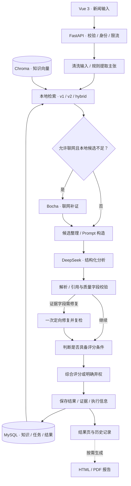

<div align="center">

<h1>智闻辨真</h1>
<p><strong>RAG 驱动的新闻证据分析平台</strong></p>
<p>检索相关材料 · 校验模型输出 · 保留证据与分析过程</p>

[](https://github.com/fjjh1413/NewsCredibilityEvaluator/actions/workflows/ci.yml)


[](contracts/prompt_output_contract.json)

**[核心能力](#features) · [工作原理](#architecture) · [快速启动](#quick-start) · [配置](#configuration) · [测试与评测](#evaluation) · [文档](#documentation)**

</div>

智闻辨真接收新闻标题、正文或链接，通过本地知识库检索和按需联网补证收集材料，再由大模型分析证据与新闻的关系。后端校验引用、分数和证据条件，保存分析结果，并支持按需生成 PDF 报告。

**证据不足或模型处理失败时，系统返回“无法判断”，最终分数为空。** 结果页保留候选、采用与排除的证据，以及工作流执行信息，方便回看分析依据。

> 当前定位：具有状态编排的 **LLM / RAG 应用**。工作流由代码定义条件路由；源码中的 Agent 命名不代表模型自主规划或自主选择工具。分析结果用于辅助核查，项目尚未完成端到端真实性判断效果评测。

<a id="features"></a>

## 核心能力

| 能力 | 实现 | 代码入口 |
|---|---|---|
| **状态工作流** | 11 个定义节点，共享状态、条件联网、一次定向修复及节点执行记录；联网和修复节点按条件执行 | [检测图](backend/app/services/detection_agent_graph.py)、[执行器](backend/app/services/agent_state_graph.py) |
| **混合检索 · v2** | 分块向量召回与词项召回，按父文档聚合，RRF 融合、多查询合并及规则重排；分别保留 cosine、融合分和重排分 | [检索](backend/app/services/rag/retrieval.py)、[融合](backend/app/services/rag/fusion.py) |
| **条件联网补证** | 根据原始 cosine 和候选数量判断是否搜索；整合 Bocha 摘要、来源与 URL 信息 | [联网服务](backend/app/services/web/web_search_service.py) |
| **模型输出校验** | 共享输出契约，检查候选 ID、重复与遗漏、立场、分数范围和证据条件；不合格时修复或弃权 | [模型服务](backend/app/services/llm_service.py)、[业务校验](backend/app/services/detection_service.py) |
| **跨存储一致性处理** | 知识与索引任务同事务保存；v2 dense 候选回查父记录状态和内容指纹；报告按数据库提交边界决定文件清理 | [知识服务](backend/app/services/knowledge_service.py)、[报告保存](backend/app/crud/report_crud.py) |
| **完整应用流程** | JWT 登录、历史与资源归属、管理后台、知识维护、Prompt 管理、结果详情及 HTML/PDF 报告 | [API](backend/app/api/v1)、[前端页面](frontend/src/views) |

**用户流程：** 输入新闻或提取链接 → 提交检测 → 查看结论状态与证据 → 按需生成报告 → 回看历史。

**管理流程：** 维护知识 → 检查索引任务 → 管理 Prompt → 审核检测与公开内容 → 查看统计和运行日志。

<a id="architecture"></a>

## 工作原理



### 检索与证据

- **知识入库与检测分离：** MySQL 保存知识和索引任务，后台完成 Embedding 与 Chroma 写入；待核查新闻作为查询，不会先被当作可信知识入库。
- **v2 检索：** 默认分块基准 700 字符、重叠 100 字符；dense 初选 50 个块，父候选上限 15，检测服务取 Top-10。上下文前缀会影响实际块长，多查询合并后也可能保留更多片段。
- **联网条件：** 在允许联网时，无本地候选、最高 cosine `< 0.45`，或最高 cosine `< 0.60` 且 cosine `>= 0.30` 的候选少于 3 条，会触发补证。融合分不替代原始 cosine。
- **有效性边界：** 词项召回采用 `LIKE` 与字段权重，重排以规则为主；联网使用摘要/片段。相似材料、不同 URL 与多条候选，都不能直接等同于充分或独立的证据。

### 分析状态与评分

| 状态 | 含义 | 最终分数 |
|---|---|---|
| `completed` | 模型、仲裁及质量校验通过，并满足当前有效证据条件 | 输出综合分 |
| `insufficient_evidence` | 缺少可用于判断的有效证据 | `null`，显示“无法判断” |
| `degraded` | 模型失败、响应无效或修复耗尽等 | `null`，显示“无法判断” |

正常完成时：`F = 0.5 × L + 0.3 × Q + 0.2 × R`，其中 `Q = 0.6 × coverage + 0.4 × consistency`。L 是模型分，R 是规则分，coverage 与 consistency 由模型提供、Q 由后端计算。该分数尚未校准为真实性概率。

<a id="quick-start"></a>

## 快速启动

### Docker Compose · 先体验应用流程

需要 Git、Docker Engine / Docker Desktop，以及支持 `--wait` 的 Docker Compose v2。以下命令从仓库根目录执行；示例使用 PowerShell，Bash 用户将 `Copy-Item` 换成 `cp`。

```powershell
git clone https://github.com/fjjh1413/NewsCredibilityEvaluator.git
cd NewsCredibilityEvaluator
Copy-Item .env.docker.example .env
```

编辑根目录 `.env`，先替换四个必需配置：`SECRET_KEY`（至少 32 字符的随机值）、`MYSQL_ROOT_PASSWORD`、`MYSQL_PASSWORD`、`FIRST_SUPERUSER_PASSWORD`。

首次体验使用 [demo 覆盖配置](docker-compose.demo.yml)：显式清空模型密钥，使用 hash 向量，关闭联网、定时抓取、异步检测和可选观测组件。它适合检查页面、数据库、演示报告和降级流程，不调用外部 LLM、Embedding 或搜索服务；用户主动提交 URL 提取仍会访问该网址。

`hash` 不具备语义检索能力，未配置真实 LLM 时新检测会降级，不能用来演示正常的模型判断或衡量准确率。

```powershell
docker compose -f docker-compose.yml -f docker-compose.demo.yml config --quiet
docker compose -f docker-compose.yml -f docker-compose.demo.yml build backend worker frontend
docker compose -f docker-compose.yml -f docker-compose.demo.yml up -d --wait mysql redis
docker compose -f docker-compose.yml -f docker-compose.demo.yml run --rm --no-deps backend python -m app.db.migrate
docker compose -f docker-compose.yml -f docker-compose.demo.yml run --rm --no-deps backend python -m app.db.init_db
docker compose -f docker-compose.yml -f docker-compose.demo.yml up -d --wait backend worker frontend
```

| 入口 | 地址或操作 |
|---|---|
| 应用 | <http://127.0.0.1:8080> |
| 就绪检查 | <http://127.0.0.1:8080/api/ready> |
| 管理员登录 | `.env` 中的 `FIRST_SUPERUSER_USERNAME` 与自行设置的密码 |
| 容器状态 / 停止 | `docker compose -f docker-compose.yml -f docker-compose.demo.yml ps` / 将 `ps` 换成 `down` |

需要演示数据时，**仅在专用演示库**中执行：

```powershell
docker compose -f docker-compose.yml -f docker-compose.demo.yml exec backend python -m app.db.seed_demo_data
```

脚本创建或更新演示账号、知识、预置检测与报告，并重新设置演示账号密码；密码输出到控制台。预置结果不代表真实模型评测。知识索引由后台异步处理，首次向量计数为 0 可能正常；切换到 DashScope 模式后，后台索引会调用外部 Embedding。

**源码开发、真实模型接入、v2 启用与排障：** [本地开发与配置指南](docs/getting-started.md)。Compose 默认使用 production 配置，Swagger 不对外开启；本地 development 模式可访问 `http://127.0.0.1:8000/docs`。

<a id="configuration"></a>

## 配置与运行模式

| 能力 | 源码 / 配置默认值 | 使用说明 |
|---|---|---|
| RAG 索引 | `RAG_INDEX_VERSION=v1` | v2 为分块混合检索；hybrid 先读 v2，空结果时回退 v1，写入走 v2 |
| 语义 Embedding | DashScope `text-embedding-v4`，1024 维 | 配置真实 Key；切换模型、维度或索引版本后重建索引 |
| 主模型 | DeepSeek，模型名由 `DEEPSEEK_MODEL` 配置 | 真实分析需有效 Key；不配置时走降级路径 |
| 网络材料 | Bocha | 需有效 Key；本次请求与全局开关共同控制补证 |
| Redis | 本地开发关闭，基础 Compose 开启 | 用于可选缓存和共享限流状态 |
| 异步检测 | `ASYNC_DETECTION_ENABLED=false` | 后端可返回任务 ID；当前 Vue 提交页尚未完整接通轮询，体验完整页面流程时保留同步模式 |
| 知识索引任务 | APScheduler 扫描任务表 | 与可选 Celery 检测任务是不同执行路径 |
| Trace / Profile | 普通本地配置关闭 | `.env.docker.example` 含生产观测选项；基础栈体验时按上文关闭 |

上表描述源码和基础 Compose；快速启动的 demo 文件显式覆盖为无模型密钥的体验模式。后端本地配置读取 [backend/.env.example](backend/.env.example) 对应的 `backend/.env`；Compose 根目录 `.env` 只替换 YAML 中显式引用的变量。**在根目录写入 `RAG_INDEX_VERSION=v2` 不会自动传入当前容器**，请按[指南](docs/getting-started.md#rag-v2)显式配置 backend 与 worker。

<a id="evaluation"></a>

## 测试与评测

### 工程验证

[2026-09-24 发布验证记录](docs/security/publication-2026-09-24.md)保存以下已完成检查的说明。顶部 CI 徽章展示 GitHub Actions 的实时状态，下面是历史验证快照。

| 范围 | 当次结果 | 主要验证内容 |
|---|---|---|
| 后端 | **565 项通过** | API、权限、检索完整性、输出校验、弃权传播、报告故障边界等 |
| 评测工具 | **146 项通过** | 数据来源与划分、泄漏门禁、指标计算、状态与续跑隔离等 |
| 前端 | **26 项通过** | 契约、状态转换及相关展示逻辑 |
| 独立目录打包 | 通过 | 干净依赖安装、前端构建、API/worker 导入及 health/ready |

测试使用 Mock、临时数据库和故障注入，覆盖“提交已成功但确认丢失”“旧向量不能从回退路径重新进入”“模型失败不得产生正常结论”等情况。测试通过数不是准确率或覆盖率；该次本机记录不包含完整 Docker 栈和生产 MySQL 验收。

从仓库根目录运行检查前，按[测试指南](docs/getting-started.md#tests)安装依赖并设置隔离环境，避免读取开发配置：

```powershell
.\.venv\Scripts\python.exe -m unittest discover -s backend/tests -t backend -p "test_*.py"
.\.venv\Scripts\python.exe -m pytest evaluation/tests -q
npm --prefix frontend ci
npm --prefix frontend test
npm --prefix frontend run build
```

### 模型与检索效果

仓库冻结了 120 条 CFEVER 原始主张及 474 个证据页标题，划分为 82 / 22 / 16 条，并保留来源、分组规则和文件哈希。独立页标题词项检索基线在 test 的 15 条可计分样本上得到 **Recall@10 = 0.9333、MRR = 0.8**；另 1 条 NEI 不计入该检索指标。

这组结果只适用于该封闭标题语料基线，**不能作为应用混合 RAG 召回率或 LLM 新闻判断准确率**。项目四级风险人工复核、片段相关性标注和端到端质量评测仍待完成。

无需模型密钥的复现入口：`.\.venv\Scripts\python.exe -m evaluation.run_title_retrieval_baseline`。详见[评测说明](evaluation/README.md)、[冻结清单](evaluation/datasets/frozen_manifest.json)及[基线结果](evaluation/baselines/cfever-title-v1/summary.json)。

<a id="roadmap"></a>

## 实现边界与下一步

- [ ] 完成应用知识库、查询与证据片段的独立标注，建立 dense / lexical / fusion / rerank 消融评测。
- [ ] 校准联网阈值、评分与弃权条件，统计回答覆盖率、引用质量、真实延迟和调用成本。
- [ ] 完善多查询后的上下文预算、全局重排和通过业务校验后再缓存的策略。
- [ ] 接通异步检测前端轮询，补充任务原子领取、崩溃恢复及完整失败轨迹。
- [ ] 加强 URL 校验与实际连接地址绑定，完善报告孤儿文件对账。

当前没有自主规划、多 Agent 协作、持久化断点恢复或已验证的模型重排收益。以上待办是后续计划，不属于已发布成果。

<a id="documentation"></a>

## 技术栈与代码导航

| 层级 | 技术 / 路径 |
|---|---|
| API 与业务 | Python 3.12 · FastAPI · Pydantic · SQLAlchemy · [backend/app](backend/app) |
| RAG 与模型 | Chroma · DashScope Embedding · DeepSeek · Bocha · [services](backend/app/services) |
| 前端 | Vue 3 · Vite · Element Plus · Pinia · ECharts · [frontend/src](frontend/src) |
| 数据与任务 | MySQL · Alembic · 可选 Redis / Celery · [迁移](backend/alembic) |
| 契约与验证 | [contracts](contracts) · [backend/tests](backend/tests) · [evaluation](evaluation) |
| 部署与观测 | Docker Compose · Nginx · Caddy · Prometheus / OpenTelemetry 等配置 · [deploy](deploy) |

| 文档 | 内容 |
|---|---|
| [本地开发与配置](docs/getting-started.md) | 源码启动、离线/真实模型、v2 配置、测试与常见问题 |
| [后端说明](backend/README.md) | 后端模块、演示数据与联调 |
| [架构决策：状态图](docs/decisions/ADR-001-explicit-agent-state-graph.md) | 节点、条件边与状态工作流 |
| [架构决策：证据完整性](docs/decisions/ADR-002-rag-evidence-integrity.md) | 分数语义、父记录验证与回退边界 |
| [输出契约](docs/prompt_output_contract.md) | 字段、风险语义及兼容规则 |
| [Docker 部署](docs/deployment/docker.md) / [运行手册](docs/deployment/runbook.md) / [备份恢复](docs/deployment/backup-restore.md) | 部署配置、运行检查与数据维护 |
| [评测](evaluation/README.md) / [发布验证](docs/security/publication-2026-09-24.md) | 可复现方法、结果范围与历史检查 |

## 反馈与配置安全

欢迎通过 [Issues](https://github.com/fjjh1413/NewsCredibilityEvaluator/issues) 提交可复现问题和改进建议。请提供提交版本、运行方式、复现步骤与脱敏日志；不要附带 `.env`、API Key、用户数据或报告原文。修改前后端字段时，先核对共享输出契约，并运行对应检查。

真实密钥、数据库、向量数据、报告、日志和备份均不应提交。生产配置应使用明确的 CORS 来源，并保持私网抓取开关关闭。项目级许可证尚未声明；评测数据的来源与上游许可见[评测文档](evaluation/README.md)。
