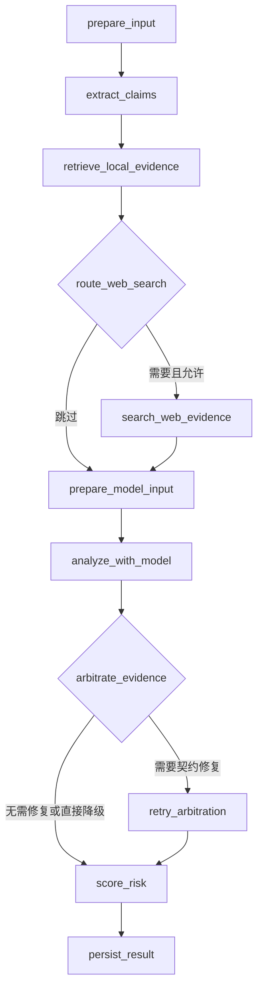

# 智闻辨真：围绕四条简历的项目深挖面试手册

核对日期：2026-09-20。依据当前本地代码和2026-09-19验收日志；本轮只读核验业务代码，不重新运行全部测试，不改实现。

目标岗位：AI Agent开发实习生 / LLM应用工程师。回答应说明实际实现、取舍和验证范围，不能把建议中的能力说成已经实现，也不能编造当时的选型过程或本人分工。

## 先校准四条简历

| 原表述 | 更经得起追问的表述 | 原因 |
|---|---|---|
| 通过节点级Trace管理执行路径 | 条件路由与有界重试控制执行，Trace记录路径和阶段耗时 | 控制执行的是状态图；Trace是观察机制。持久化阶段耗时仍有缺口 |
| 向量召回→词项召回→RRF→父文档聚合 | 支持向量/词项混合召回、父文档聚合及RRF融合 | 两路召回是不同来源；v2实际先统一父候选，再计算融合分。代码默认索引版本是v1 |
| 证据覆盖校验 | 候选处理完整性校验，并记录主张覆盖诊断 | 候选ID覆盖有硬约束；主张覆盖并不是全部主张必须有充分证据的硬门禁 |
| 基于内容指纹解决向量库、MySQL与报告文件一致性 | 内容指纹和数据库状态校验过滤过期向量；事务提交与文件清理边界保障报告引用安全 | 指纹不负责报告文件一致性；整个系统没有分布式强一致事务 |

“避免无依据生成结论”宜解释为：对可识别的模型失败和无有效证据场景停止综合评分；不能承诺彻底消除幻觉或错误结论。

简历中的565/146/26是特定代码工作区的测试通过数，不是覆盖率或准确率。项目日期保留你提供的2026.04—2026.06，但这些验收日志产生于2026-09-19，新增能力属于后续迭代时应如实说明，不能声称六月版本已经拥有全部结果。

公开主页目前指向main并展示较早README；只读查询远端分支得到main=`cf0f9cee9a72d4d82ab0fe876450deeeb115bd23`、evaluation/real-metrics=`0a2a0f464af3fc335e647926913a1f573ff30b09`。本地新增状态图及P0文件仍有未跟踪/未提交内容，所以远端分支不能自动证明这些实现。投递前应确保简历链接能定位对应代码及验证记录。本轮没有提交或推送。

来源：[GitHub项目主页](https://github.com/fjjh1413/NewsCredibilityEvaluator)、本地Git状态与远端分支只读查询、[P0验收记录](../p0-implementation-2026-09-19.md)。

## 开场：60—90秒项目介绍

> 智闻辨真是一个面向新闻核查的RAG证据分析应用。用户输入新闻后，后端提取主张并检索本地知识；证据不足且允许联网时，再补充网络候选。DeepSeek结合新闻和候选证据生成结构化分析，后端校验引用、分数及候选是否处理完整，再决定评分或者返回无法判断。
>
> 工程重点有三部分：第一，用11节点显式状态图管理条件分支和一次定向仲裁修复；第二，在v2检索中实现向量与词项召回、父文档聚合和RRF融合，并区分检索分数的含义；第三，对过期向量、模型无效输出和报告提交异常设置明确处理边界，用临时数据库和故障注入验证。
>
> 当前它是固定流程的受控LLM工作流，没有模型自主规划和多Agent协作。已有工程行为测试，但新闻判断准确率和生产RAG召回率还没有完成合格的端到端评测。

## 一、工作流编排：7问

### 1. 为什么不直接把新闻交给大模型？这个项目多做了什么？

**考察：** 能否解释检索、业务校验和持久化的价值，而不是复述框架名称。

**答法：** 项目先构造可追溯候选，再要求模型说明每个候选的相关性、立场和处理结果。后端保有候选集合，能够拒绝不存在的ID、非法分数和未处理候选，模型异常或没有有效证据时不发布综合分；分析状态、候选和轨迹保存后可以复查。

**追问与边界：** RAG不保证事实正确；检索可能遗漏、来源可能不可靠、模型可能误判。当前能证明的是检索及验证流程存在，不能声称比裸模型提高多少准确率。

**代码：** [detection_service.py:322](../../backend/app/services/detection_service.py#L322)、[assessment.py](../../backend/app/core/assessment.py)。

### 2. 这是Agent吗？模型能自己选择工具吗？

**考察：** 是否把普通应用编排包装成自主Agent。

**答法：** 当前是确定性条件路由的LLM工作流。由代码根据检索分数、候选数量和校验结果决定是否联网、是否重试。模型负责生成分析和证据立场，不生成任意执行计划，也不通过原生tool calling自主选择工具。

**追问与边界：** 与Agent岗位相关的能力是状态管理、工具接口、失败边界、结构化校验和可观测性；自主规划、多Agent协作、长期记忆或人工暂停恢复需要另外的实现证据。

**代码：** [detection_agent_graph.py:84](../../backend/app/services/detection_agent_graph.py#L84)。

### 3. 11个节点分别是什么？每次都执行11个吗？

**考察：** 数字是否真正对应代码，是否理解实际路径。

| 节点 | 职责 |
|---|---|
| prepare_input | 清洗并检查标题/正文 |
| extract_claims | 提取关键词和规则主张 |
| retrieve_local_evidence | 查询本地知识并整理候选 |
| route_web_search | 判断是否允许及需要联网 |
| search_web_evidence | 可选的网络补证 |
| prepare_model_input | 候选编号、确定性打散、加载Prompt |
| analyze_with_model | 主模型分析 |
| arbitrate_evidence | 后端校验主调用返回的仲裁结果 |
| retry_arbitration | 可选的一次定向修复 |
| score_risk | 质量处理、评分或弃权 |
| persist_result | 保存检测结果和快照 |

**答法：** 11是定义节点数。完整执行且无异常时，不联网不修复经过9个节点，启用其中一个可选节点经过10个，两者都有经过11个。`arbitrate_evidence`本身是后端校验，不意味着又调用一个模型。



**追问与边界：** 中途异常可能更早终止；不要把节点数当成模型调用数或Agent数量。

**代码：** [节点及边定义](../../backend/app/services/detection_agent_graph.py#L13)。

### 4. 为什么用状态图？这是LangGraph吗？

**考察：** 是否理解抽象价值和框架边界。

**答法：** 这是仓库内自定义的同步StateGraph。节点接收共享的DetectionAgentState，边和条件边显式定义；编译时检查图配置，执行时记录节点和跳转。相比把分支全部嵌在一个大函数里，可以单独验证路径、观察失败节点，新增分支时也有明确入口。

**追问与边界：** 不能说使用了LangGraph。当前图足以表达两个固定分支，但如果要持久检查点、暂停恢复和复杂调度，应重新评估现有实现与成熟工作流框架的取舍；这些能力不是当前已有功能。

**代码：** [agent_state_graph.py:89](../../backend/app/services/agent_state_graph.py#L89)、[DetectionAgentState](../../backend/app/services/detection_agent_graph.py#L29)。

### 5. 一条请求调用几次LLM？为什么是定向重试？

**考察：** 调用成本、边界和模型职责划分。

**答法：** 在配置正常、确实进入模型步骤的情况下，正常路径一次主分析；主分析的仲裁/质量契约不合格时，最多额外一次仅处理证据相关字段的修复。主张提取、路由、规则评分都不需要LLM。没有密钥或Prompt无法安全渲染时，可能根本不发外部请求；命中缓存也不等于新增一次网络调用。

**追问与边界：** 不是所有错误都重试：供应商失败或主评分原始类型无效会降级；修复不能让一个非法主评分重新变成有效结论。当前即使无候选也可能先执行主分析再弃权，可进一步增加前置判定来节约调用。

**代码：** [主分析和仲裁分支](../../backend/app/services/detection_service.py#L452)、[修复调用](../../backend/app/services/llm_service.py#L182)。

### 6. 如何避免死循环？进程崩溃能从中间恢复吗？

**考察：** 有界执行和耐久执行是否混淆。

**答法：** 当前图的修复节点执行后直接进入评分，不回到主分析；调用图时max_steps设为定义节点数量。节点异常会记录失败信息并重新抛出，因此执行有步数上限。

**追问与边界：** 步数限制不是端到端超时，内存状态也不是检查点。当前不能保证进程重启后从失败节点继续；若增加耐久执行，需要状态存储、幂等步骤、租约和恢复策略。

**代码：** [invoke](../../backend/app/services/agent_state_graph.py#L186)、[图调用入口](../../backend/app/services/detection_service.py#L929)。

### 7. Trace记录什么？能保证所有失败都有完整轨迹吗？

**考察：** 是否把装饰性的步骤展示当成真实可观测性。

**答法：** 图执行器记录visited_nodes、transitions、节点耗时、状态和异常类型；业务层还记录检索、联网、LLM、规则等阶段耗时，并可接入OpenTelemetry span。展示轨迹不包含模型隐藏推理。

**追问与边界：** 节点函数正常返回不代表业务分析成功，降级结果也可能走完图。当前持久化前组装快照、持久化后才测到db_save耗时，而且persist_result在快照中预填结束状态，数据库里的轨迹不具备完整的最终持久化耗时。中途异常的内存journal也不保证持久保存。下一步可独立保存run/node事件，而不是宣传完整故障回放。

**代码：** [GraphExecutionJournal](../../backend/app/services/agent_state_graph.py#L43)、[快照与保存](../../backend/app/services/detection_service.py#L736)、[OTel接入](../../backend/app/core/tracing.py#L87)。

## 二、混合RAG：9问

### 8. 你写的混合RAG每次都会运行吗？v1/v2/hybrid是什么？

**考察：** 是否沿真实调用链确认了开关。

**答法：** 代码默认`RAG_INDEX_VERSION=v1`。v2支持分块向量与词项召回、父候选融合和规则重排；hybrid先走v2，v2返回空候选时允许回退v1。索引版本切换需要匹配的索引数据，不能只修改简历或一个配置值。

**追问与边界：** 这里的hybrid索引版本回退，与v2内部的dense+lexical混合召回是两个概念。向量检索异常会转为检索失败，不等于自动成功联网；空结果和服务异常是不同路径。

**代码：** [版本默认值](../../backend/app/core/config.py#L84)、[路由与回退](../../backend/app/services/knowledge_service.py#L376)。

### 9. 为什么同时用Embedding、Chroma和MySQL？更换Embedding要做什么？

**考察：** 向量表示、检索和业务真源的职责。

**答法：** Embedding把知识和查询映射为向量；Chroma保存向量、文本和metadata并返回相似候选；MySQL保存原始知识、同步状态、权限和业务关系。当前配置默认DashScope text-embedding-v4、1024维；hash只是离线流程测试模式。

**追问与边界：** 同维度不等于同向量空间，更换模型也需要重建索引或隔离collection，查询和知识向量必须匹配。选择Chroma可解释为当前持久化查询需求与已有接口匹配，但没有竞品压测就不能声称它比其他向量数据库更快。

**代码：** [Embedding实现](../../backend/app/services/embedding_service.py#L543)、[配置](../../backend/app/core/config.py#L15)、[Chroma查询](../../backend/app/services/chroma_service.py#L228)。

### 10. Chunk怎么切？700和100的单位是什么？

**考察：** 是否真的打开过切分器。

**答法：** 配置是700字符目标块长、100字符重叠，不是token数。按段落组织，长段落使用滑窗，按父知识记录关联chunk。小块有利于定位相关片段，保留父ID便于避免同篇长文占满候选。

**追问与边界：** 现有实现长段滑窗后还会为相邻块追加前块末尾重叠，正文块还附加标题/来源等上下文，因此实际块长可能超过700，并存在重复重叠。标题摘要和辟谣说明还另建块。不能说实现了严格700-token分块或“最优切分”。应修正重复重叠并在标注集上比较不同块长、重叠和父聚合策略。

**代码：** [split_text](../../backend/app/services/rag/chunker.py#L37)、[配置](../../backend/app/core/config.py#L258)。

### 11. 词项召回是不是BM25？为什么需要它？

**考察：** 是否把任意关键词搜索写成标准检索算法。

**答法：** 当前是数据库词项匹配加字段命中评分，不是BM25。标题、关键词、摘要和正文的匹配权重不同，补充向量检索之外的字面匹配信号；名字、数字和专有词等需要保留精确信息的场景是合理动机。

**追问与边界：** 没有IDF与标准长度归一化；候选还会受SQL预筛选和limit影响，可能在精排前漏掉相关文档。是否优于纯dense需要消融实验，不能凭设计宣称召回提升。

**代码：** [词项评分与查询](../../backend/app/services/rag/retrieval.py#L123)、[知识CRUD](../../backend/app/crud/knowledge_crud.py)。

### 12. RRF是什么？你的实现和标准公式完全相同吗？

**考察：** 能否解释公式与代码改动。

**答法：** 基本RRF把各路排名贡献`1/(k+rank)`相加，避免直接相加不同量纲的原始分。项目实现为归一化加权变体，默认k=60，dense和lexical权重0.70/0.25，另加0.05的exact信号：

```text
S = clip[0,1](0.70 × 61/(60+r_dense)
            + 0.25 × 61/(60+r_lexical)
            + 0.05 × exact_score)
```

某一路未命中时该项为0。v2先按knowledge_id构造父候选，取dense最佳排名/相似度、汇集chunks和词项信号，再计算融合分；不是先对chunk做完RRF才第一次聚合父记录。这里的exact是标题词项命中信号，不等于整段文本完全一致。

**追问与边界：** k及权重是工程配置，尚非验证集调优的最优参数；归一化到0—1也不意味着概率或cosine。父候选的dense排名来自最佳chunk位置，并非另行重排后的连续父排名。

**代码：** [normalized_rrf_score](../../backend/app/services/rag/fusion.py#L44)、[父聚合与融合](../../backend/app/services/rag/retrieval.py#L216)。

### 13. 主张提取和多查询是什么？是不是模型Query Rewrite？

**考察：** RAG增强步骤是否真实，是否额外消耗模型调用。

**答法：** 主张由规则从标题和正文句子中抽取，默认最多5条；查询计划先放整篇新闻查询，再追加去重后的主张查询，默认最多4个查询。每个查询检索后，按父ID进行第二层跨查询RRF融合。这不是LLM生成的语义改写。

**追问与边界：** 默认4个总查询不是4条主张再加整篇；当前多查询调用是顺序执行。多查询可能改善子主张覆盖，也增加向量调用和延迟；没有实测数据不能说已经提速或提高召回。

**代码：** [规则主张](../../backend/app/services/evidence_arbitration_quality.py#L61)、[query_planner.py:31](../../backend/app/services/rag/query_planner.py#L31)、[跨查询调用](../../backend/app/services/detection_service.py#L1039)、[第二层融合](../../backend/app/services/rag/fusion.py#L140)。

### 14. 何时联网？0.45、0.60和0.30从哪里来？

**考察：** 路由规则、分数语义和阈值依据。

**答法：** 全局及请求均允许联网后：无本地候选则触发；最大原始cosine小于0.45则触发；最大cosine小于0.60且cosine至少0.30的候选少于3个，也触发。使用最大cosine而不是重排后的第一条分数，避免融合排名改变路由含义。

**追问与边界：** 三个阈值是已有启发式常量，尚未证明最优，也不代表正确率。仅词项命中的候选没有可靠cosine，路由会保守地尝试联网；后续可在dev集联合权衡证据质量、调用成本、延迟和弃权率。

**代码：** [联网阈值及路由](../../backend/app/services/web/web_search_service.py#L24)、[全局与请求开关](../../backend/app/services/detection_service.py#L374)。

### 15. cosine、fusion、rerank有什么区别？你接了模型Reranker或标准MMR吗？

**考察：** 排名分、相似度及事实置信度是否混用。

**答法：** raw_cosine_score记录向量相似度；similarity_score是兼容旧路径的非负别名；fusion_score用于融合排名；rerank_score用于重排。一个候选可能有很高的融合分但较低cosine，融合分不能用于cosine阈值。实际运行链路有规则重排；模型rerank只预留回调，主检索调用没有传入真实模型实现。

**追问与边界：** `_apply_mmr`当前按重复source_name减分，缺少经典MMR中的候选两两相似度项，应称来源多样性惩罚。高检索分无法证明新闻真实，相似的辟谣文章可能恰恰反驳输入。

**代码：** [结果字段](../../backend/app/services/rag/contracts.py#L72)、[来源惩罚](../../backend/app/services/rag/retrieval.py#L318)、[重排接口](../../backend/app/services/rag/reranker.py#L119)。

### 16. 怎么控制Context？去重和证据压缩到底做了什么？

**考察：** 检索结果是否原样全塞给模型。

**答法：** 检测入口本地最终Top-K为10，默认模型最多看10条候选；有网络结果时合并默认采用本地5条、网络5条。合并保留chunks、supporting_spans和检索诊断字段，并在来源内部按知识ID、可用URL等身份去重。URL规范化只用于比较，保留路径/查询大小写，避免错误合并不同页面。supporting_spans来自查询词命中附近的字符窗口。

**追问与边界：** 它是词项窗口提取，不是模型语义压缩；原document/chunks仍保留，不能宣称因此减少了token，也没有严格全局token预算。知识ID优先分支不会继续按URL去重，不跨本地/网络做硬去重；相同站点不同URL可能是转载，页面去重不等于独立信源去重。当前质量统计canonical_source含路径，不能把其计数直接称为独立机构数量。

**代码：** [候选合并](../../backend/app/services/web/web_search_service.py#L212)、[URL规范化](../../backend/app/services/web/web_search_service.py#L480)、[片段提取](../../backend/app/services/rag/contextual_compression.py#L30)。

## 三、LLM可靠性：7问

### 17. Prompt怎么组织？模板、System/User和输出契约分别做什么？

**考察：** 是否理解模型输入接口而不只是写一段提示词。

**答法：** System约束分析职责、JSON输出及输入安全边界；User提供标题、正文、候选证据和主张。数据库管理默认模板，模板不可用时有经过校验的代码兜底；共享JSON契约统一字段与允许值。发送前检查新闻和证据确实保留在渲染结果中。

**追问与边界：** JSON模式不保证完整schema或事实正确。当前temperature=0.2、默认单次调用timeout=30秒，但低温不等于完全确定。已有契约版本不等于每次运行都保存了Prompt内容哈希、模型精确版本与完整发布历史。

**代码：** [构造Prompt](../../backend/app/services/llm_service.py#L279)、[API参数](../../backend/app/services/llm_service.py#L509)、[共享契约](../../contracts/prompt_output_contract.json)。

### 18. 为什么校验candidate_id？模型返回合法JSON还可能有什么错？

**考察：** 结构化输出与业务有效性是否分离。

**答法：** JSON可能包含不存在的证据、重复ID、同时采纳和排除同一个候选、遗漏候选、非法立场、空理由或非有限分数。后端维护候选映射，校验ID与集合关系；ranked和rejected合起来必须覆盖候选，任何错误都会使本次仲裁结果失效。

**追问与边界：** 拒绝NaN、无穷、布尔和数值字符串被当作合法原始评分；不能先把非法值clamp成0再宣称通过校验。但模型仍然可能对真实候选作出错误立场判断，ID校验不会解决语义误判。

**代码：** [validate_and_apply_llm_ranking](../../backend/app/services/detection_service.py#L145)、[主评分原类型校验](../../backend/app/services/llm_service.py#L660)。

### 19. “证据覆盖”到底指什么？能保证每个主张都被证明吗？

**考察：** 这是简历中最容易被深挖的概念。

**答法：** 要分三层：一是候选处理完整性，候选都要被采纳或排除，这是硬校验；二是根据claim_ids计算的后端主张覆盖诊断；三是LLM返回的evidence_quality.coverage数值，后端检查类型/范围，并以coverage>0参与是否可评分的判断。

**追问与边界：** 当前不能保证所有核心主张都有充分证据。后端claim_coverage只是诊断，不是必须100%的硬门禁；LLM的coverage也不是人工核验结果。合理改进是为关键主张建立逐项支持/反驳证据和冲突门禁，再评测是否减少误判。

**代码：** [候选集合完整性](../../backend/app/services/detection_service.py#L145)、[主张覆盖诊断](../../backend/app/services/evidence_arbitration_quality.py#L149)、[当前评分门禁](../../backend/app/services/detection_service.py#L649)。

### 20. 定向修复具体怎么执行？为什么不无限重试？

**考察：** 异常可恢复性、成本与失控边界。

**答法：** 主评分有效但仲裁/质量字段无效时，构造只要求evidence_arbitration、evidence_quality及相关结果的紧凑Prompt，重新提供新闻、候选和契约；额外尝试一次并重新执行同样校验。成功后替换证据相关结果，失败标记retry_exhausted并弃权。

**追问与边界：** 这是契约修复，不是网络异常指数退避；当前没有把逐条validation error完整作为错误反馈传给模型，也不会重新检索。上限控制额外成本和延迟，但没有实验能证明一次就是最佳次数。

**代码：** [修复节点](../../backend/app/services/detection_service.py#L515)、[修复Prompt](../../backend/app/services/llm_service.py#L230)。

### 21. 什么情况下弃权？HTTP 200和完成有什么关系？

**考察：** 产品状态与技术请求状态是否混淆。

**答法：** 模型服务失败、非法主输出或修复失败属于degraded；无有效证据、coverage为0或只有neutral背景属于insufficient_evidence。它们的final_score为null、风险显示无法判断，不以规则诊断高分替代结论。API可200表示请求已处理，但业务状态、页面、报告和审计都保留弃权含义。

**追问与边界：** 现在对有效证据的最低判断是support/contradict且相关性、质量为正，配合质量状态与coverage检查；不意味着通过严格事实证明。旧数据legacy表示缺少完整诊断，不应宣传为经过新版验证。

**代码：** [assessment.py](../../backend/app/core/assessment.py)、[评分/弃权](../../backend/app/services/detection_service.py#L573)、[接口状态](../../backend/app/api/v1/detect.py#L80)、[前端解释](../../frontend/src/utils/assessmentState.js)。

### 22. 最终分数怎么算？权重是训练出来的吗？

**考察：** 指标是否可解释，是否误称概率或模型独立验证。

**答法：** 只在completed时计算：`Q=0.6×coverage+0.4×consistency`，`F=0.5×LLM评分+0.3×Q+0.2×规则分`。Q由后端按公式计算，但coverage和consistency来自模型。80/60/40划分四级风险，综合分越高表示越可信。

**追问与边界：** 这是启发式评分，不是校准过的真实性概率；权重和阈值没有训练/验证集最优性证明。返回的evidence_score不是最终公式中的0.3项。后端还产生质量校准和冲突诊断，但不能说这些诊断全部已进入最终公式。

**代码：** [Q计算](../../backend/app/services/llm_service.py#L1092)、[F计算](../../backend/app/services/detection_service.py#L662)、[风险阈值](../../backend/app/core/constants.py)。

### 23. 检索分数会诱导模型吗？如何处理Prompt Injection？

**考察：** 输入偏置、非可信文本和模型权限边界。

**答法：** 候选按新闻和candidate_id的哈希确定性打散，递归去掉检索排名、cosine、融合及重排分，保留证据正文，让模型重新判断相关性。标题和正文被转义并放进边界标签，System和User声明输入中的指令不能改变任务；模型输出之后仍有业务校验。

**追问与边界：** 打散只是减少顺序偏置的一种措施，没有实验就不能说消除了偏置。Prompt约束和标签不是安全沙箱，不能保证恶意网页不会影响判断；固定工作流不让模型直接执行任意工具，但内容误导风险仍需攻击样例和人工评审。

**代码：** [确定性排序](../../backend/app/services/detection_service.py#L127)、[安全边界](../../backend/app/services/llm_service.py#L73)、[递归去分数](../../backend/app/services/llm_service.py#L1074)。

## 四、工程质量、测试与取舍：7问

### 24. MySQL内容改了但Chroma还是旧向量，如何避免返回旧证据？

**考察：** 跨存储一致性是否只有一句口号。

**答法：** 新v2 chunk保存parent_revision：对标题、正文、来源等证据相关字段做确定性哈希，排除同步时间等易变字段。检索后批量查询当前父记录，只接受存在、synced且指纹一致的候选，同时复核过滤条件。父记录已删、已更新或旧chunk无指纹，都不能作为有效dense证据返回。

**追问与边界：** 指纹证明版本对应，不证明内容真实或不受恶意篡改；读取后到模型使用之间仍可能发生新更新，所以没有线性一致性保证。hybrid回退还排除v2 chunk和已由v2管理的父记录，防止旧证据从v1重新进入。

**代码：** [指纹字段](../../backend/app/services/rag/vector_index.py#L36)、[批量父校验](../../backend/app/services/rag/retrieval.py#L60)、[回退排除](../../backend/app/services/knowledge_service.py#L414)、[组合测试](../../backend/tests/test_rag_evidence_integrity.py)。

### 25. 写入MySQL成功、写向量失败怎么办？这是分布式事务吗？

**考察：** 同步状态、重试与原子性的界限。

**答法：** 知识变更和索引任务在关系数据库侧记录，索引任务负责写向量，知识有pending/synced/failed状态及错误信息；失败可重试，读路径不使用未同步证据。删除和修复路径也有补偿逻辑。这是状态管理、异步重试和读时校验的组合，不是MySQL与Chroma的原子提交。

**追问与边界：** 当前任务并发抢占、处理租约和崩溃恢复仍有完善空间，不能承诺exactly-once。旧v2无parent_revision必须重建，不能为了保持召回而跳过校验。

**代码：** [知识变更服务](../../backend/app/services/knowledge_service.py#L294)、[索引任务](../../backend/app/services/knowledge_index_jobs.py)、[升级说明](../decisions/ADR-002-rag-evidence-integrity.md)。

### 26. 为什么commit后refresh失败会导致报告丢失？怎么修？

**考察：** 能否区分“函数抛异常”和“事务未提交”。

**答法：** 旧路径先生成文件，数据库commit成功后refresh再失败，上层若把所有异常都当成未提交就会删掉新文件，而数据库已经引用它。现在取消清理边界内的commit后refresh；提交前失败可清新文件，提交成功才清旧文件；一旦已尝试commit但结果不确定，则保留新文件等待核对。

**追问与边界：** rollback不能撤销已成功的commit。提交确认丢失测试是真实SQLite先commit，再注入异常并核对数据库路径和文件存在。保留文件可能产生孤儿，代价是后续需要对账清理；不意味着报告生成已具备完整并发幂等。

**代码：** [提交边界](../../backend/app/crud/report_crud.py#L151)、[文件清理边界](../../backend/app/services/report_service.py#L196)、[确认丢失回归](../../backend/tests/test_p0_pipeline_regressions.py#L245)。

### 27. 565、146、26具体是什么？Mock是不是只测了自己写的假数据？

**考察：** 是否能用可复现证据解释工程质量。

**答法：** 分别是2026-09-19后端unittest、评测pytest和前端Node测试通过数，不是覆盖率。新增组合场景在外部检索/网络/模型transport边界替换响应，但运行真实状态图、Prompt构造、解析校验、Pydantic、临时SQLite和报告编排；另有真实Chroma增查删及真实PDF转换测试。

**追问与边界：** Mock适合稳定复现“模型编造ID、返回非法分数、重试耗尽、commit确认丢失”等条件，不证明真实供应商响应质量、网络可靠性或MySQL行为。测试数不等于自己从零编写的数量，也不能换算为100%覆盖率。20项P0定向测试已包括在565项内，不能重复相加。

**代码：** [组合测试接缝](../../backend/tests/test_p0_pipeline_regressions.py#L65)、[真实Chroma测试](../../backend/tests/test_chroma_integration.py)、[验收记录](../p0-implementation-2026-09-19.md)。

### 28. RAG召回率、新闻判断准确率是多少？怎样做可信评测？

**考察：** 能否承认缺失，并给出可执行的评测方法。

**答法：** 当前没有可发布的生产RAG召回率或四级新闻判断准确率。已隔离旧泄漏样本，冻结120条官方CFEVER原始主张及上游标签/证据页；用共享页分组并固定82/22/16 split，保存来源和文件hash。项目四级标签和应用片段相关性仍需独立人工标注。

**追问与边界：** 已运行的0.9333 Recall@10属于474个页标题的封闭词项基线，test仅15条有证据样本，不是全文RAG效果。下一步冻结知识库、标注相关文档/片段，在dev选参数、test只作最终评估；对比dense、lexical、融合、重排。端到端还要报告弃权覆盖率、选择性准确率、全体已标注样本准确率，以及延迟和成本，避免靠大量弃权美化指标。

**代码：** [数据及基线说明](../../evaluation/README.md)、[发布门禁](../../evaluation/dataset_quality.py#L28)、[分类与弃权指标](../../evaluation/metrics.py#L418)。

### 29. FastAPI能扛高并发吗？URL和报告访问有什么安全措施？

**考察：** 是否把框架名称等同于并发和安全能力。

**答法：** 当前检测入口是同步函数，内部模型和检索有阻塞调用；FastAPI不自动消除这些等待。可选Celery路径提交任务并返回202，但不能把该配置等同于完整异步产品闭环。接口有身份与限流处理；URL抓取有地址检查，报告要求所有者/管理员权限并检查文件路径范围。

**追问与边界：** 多请求会占用线程和供应商配额，应测排队时间、P95/P99及超时，并完善任务幂等、租约和前端轮询。SSRF地址检查不等于消除DNS重绑定风险；检查IP与实际连接绑定仍需加固。文件名和路径检查也应结合权限，不能只靠前端隐藏按钮。

**代码：** [同步/异步入口](../../backend/app/api/v1/detect.py#L80)、[worker配置](../../backend/app/worker.py)、[网页抓取](../../backend/app/services/web/web_content_fetcher.py)、[报告权限及路径](../../backend/app/services/report_service.py#L388)。

### 30. 你认为最难的技术点是什么？下一步优先改什么？

**考察：** 判断力、失败经验和能否识别真正瓶颈。

**答法：** 可以选一个确实能打开代码讲清楚的具体问题：①融合分误当cosine导致联网路由错误；②父记录修改后旧向量仍可被召回；③commit成功后refresh异常误删报告。按“复现条件→根因→修复边界→回归断言→剩余风险”说明，不编造当时的线上事故、用户损失或本人经历。

**追问与边界：** 下一步优先补真人评测及真实服务基线，然后修复分块重复重叠、完整保存失败轨迹/耗时、改进主张证据门禁和任务恢复。是否增加模型reranker或自主规划，应由失败分析决定；不要为了Agent岗位给现有固定任务增加无意义的多Agent层。

**代码：** [RAG决策记录](../decisions/ADR-002-rag-evidence-integrity.md)、[报告回归](../../backend/tests/test_p0_pipeline_regressions.py#L238)、[P0验收与未完成项](../p0-implementation-2026-09-19.md)。

## 快速参数卡：区分配置值、运行路径和质量指标

| 项目 | 代码可证值/含义 | 面试限定 |
|---|---|---|
| 定义工作流节点 | 11 | 不等于每次走11个，更不等于11次LLM调用 |
| 主张提取 | 规则，默认最多5条 | 非LLM claim decomposition |
| 检索查询 | 默认最多4个总查询 | 含整篇查询；当前顺序执行 |
| 默认索引版本 | v1 | 混合dense+lexical能力在v2路径 |
| Embedding | DashScope text-embedding-v4，默认1024维 | 配置默认，不是模型能力或最佳维度的实验结论 |
| Chunk配置 | 700/100字符 | 有追加重叠细节，不是严格token上限 |
| dense召回 | 默认50 chunks | 不等于50篇独立文档 |
| 父候选配置 | 默认15，每父默认留2 chunks | 主检测最终Top-K仍为10 |
| RRF常数 | 60 | 启发式；项目是归一化加权变体 |
| 模型候选上限 | 10 | 不等于严格token预算 |
| 本地+网络合并 | 默认5+5 | 只在确实获得网络结果并调用合并时适用 |
| 联网门槛 | 0.45；0.60且有效数<3；有效cosine≥0.30 | 使用原始cosine，不是融合分，不是准确率 |
| 模型参数 | temperature=0.2；默认单调用timeout=30秒 | 非整条请求时间上限 |
| 仲裁修复 | 最多额外1次 | 非所有错误重试，不是指数退避 |
| 综合分 | 0.5L+0.3Q+0.2R | 仅completed；不是概率 |
| Q | 0.6coverage+0.4consistency | 两个输入仍由模型给出 |
| 风险阈值 | 80/60/40 | 启发式，分高表示更可信 |
| 测试通过数 | 565后端、146评测、26前端 | 2026-09-19工作区记录；不是模型准确率 |

参数来源集中在[config.py](../../backend/app/core/config.py)、[detection_service.py](../../backend/app/services/detection_service.py)、[llm_service.py](../../backend/app/services/llm_service.py)、[web_search_service.py](../../backend/app/services/web/web_search_service.py)。实际环境变量可覆盖配置默认值，不能仅靠默认值宣称部署实例正在使用它。

## 自测方式

先不看答案，用一张纸画实际路径；随后分别演示一次本地成功、一次仲裁修复、一次provider失败弃权和一次报告提交确认丢失。每次说明输入、走了哪些节点、模型尝试次数、数据库状态、最终响应及断言。

优先准备的题是2、3、7、8、12、14、19、21、22、24、26、28。能够打开对应代码解释这些问题，比背诵框架定义更有说服力。尚未做过的实验应明确给出验证计划，不代入虚构收益。
