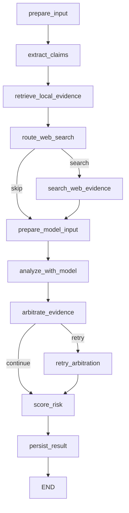

# P1 显式 Agent 状态图规格

记录日期：2026-08-13

## Objective

把 `detect_news_credibility` 中隐含的顺序、条件分支、重试与降级路径建模为可执行状态图，使检测 Agent 的控制流可以被单独测试、回放和观测，同时保持当前检测结果、持久化结构和 Agent Trace v1 兼容。

本轮不引入 LangGraph、Temporal、DBOS 等运行时，不增加模型调用，不修改数据库结构。先证明状态模型和节点边界稳定，再评估耐久执行框架。

## State contract

`DetectionAgentState` 是单次运行的内部可变状态，至少包含：

- 输入上下文：数据库会话、请求、当前用户、清洗后的标题与正文。
- 检索上下文：核心主张、关键词、候选证据、联网路由决定与结果。
- 仲裁上下文：模型结果、仲裁状态、重试次数、有效与排除证据。
- 评分上下文：规则分、模型分、最终分、风险等级和用户可见解释。
- 运行元数据：已执行节点、条件边、每节点状态和耗时。

状态图元数据只记录节点 ID、边、状态、耗时和低敏摘要，不记录正文、完整 prompt、密钥、工具原始参数或模型隐藏推理。

## Graph



## Nodes and boundaries

| Node | Responsibility | Side effects |
|---|---|---|
| `prepare_input` | 清洗并校验输入 | 无 |
| `extract_claims` | 提取关键词和核心主张 | tracing |
| `retrieve_local_evidence` | 执行本地混合检索并格式化候选 | Chroma/DB read |
| `route_web_search` | 只计算联网策略 | 无 |
| `search_web_evidence` | 调用联网工具并合并候选 | external HTTP |
| `prepare_model_input` | 候选 ID、稳定中性排序、加载输出契约 | DB read |
| `analyze_with_model` | 一次结构化可信度分析 | external LLM |
| `arbitrate_evidence` | 校验仲裁契约并决定是否重试 | 无 |
| `retry_arbitration` | 最多一次聚焦仲裁重试 | external LLM |
| `score_risk` | 质量控制、规则评分与结果组装 | 无 |
| `persist_result` | 保存检测记录并返回兼容响应 | DB write |

## Commands

```powershell
python -m unittest backend.tests.test_agent_state_graph
python -m unittest backend.tests.test_agent_trace backend.tests.test_detect_api
python -m unittest discover -s backend/tests -t backend -p "test_*.py"
python -m unittest discover -s evaluation/tests -p "test_*.py"
npm --prefix frontend test
npm --prefix frontend run build
git diff --check
```

## Testing strategy

- 图执行器单元测试：顺序边、条件边、未知路由、环路上限和失败节点。
- 节点级测试：联网跳过/触发、仲裁直通/重试/耗尽、未仲裁证据不能参与评分。
- 特征测试：现有检测服务测试必须保持结果和 mock 边界兼容。
- 契约测试：`agent_steps` 和 Agent Trace v1 保持兼容；新增图元数据通过 Pydantic 校验。

## Boundaries

- Always：外部结果继续做结构校验；节点失败显式记录；保留现有降级语义。
- Ask first：新增依赖、数据库迁移、修改模型提供商或增加模型调用。
- Never：在图元数据中记录敏感内容；让未仲裁证据进入评分；为“多 Agent”标签拆出额外模型角色。

## Success criteria

- 主编排函数只负责创建状态并运行图，不再内联实现完整检测流程。
- 图定义能静态列出节点和条件边；执行结果能给出真实访问路径。
- 本地充分证据路径跳过联网节点；仲裁契约失败路径最多执行一次重试节点。
- 同步 API、异步任务、历史详情和旧 `agent_steps` 行为不变。
- 后端 525、Evaluation 117、前端 16 的 P0 基线不下降。

## Implementation status

P1 已于 2026-08-13 完成首轮实现：

- 11 个命名节点、2 条条件边已经成为可执行图定义；主入口仅创建状态并调用图。
- 真实访问节点、条件路由、节点状态与耗时写入 Agent Trace v1 的强类型 `graph_execution` 字段。
- 同步检测、Celery 异步结果和历史详情均保留同一图执行数据；旧 `agent_steps` 继续兼容。
- 用户结果页和管理员详情页展示实际执行路径；旧记录无图数据时不显示空壳组件。
- 未引入第三方 Agent 框架、数据库迁移或额外模型调用。

验收结果：后端 533 个测试、Evaluation 117 个测试、前端 18 个测试及 Vite 生产构建全部通过。当前源码中的 `detect_news_credibility` 已收敛为 22 行薄入口；`score_risk` 节点仍为 148 行，主要包含质量控制、评分与检索统计装配，列入下一轮纯函数化候选，不阻塞 P1。

浏览器移动视口初次验证时，Vite 已启动但 `127.0.0.1:8000` 没有后端监听，开发代理因此返回空响应 500；这不是详情接口或状态图序列化异常。启动 FastAPI 后，健康检查返回 200，同一详情请求按未登录状态正确返回 401 并跳转登录页，浏览器控制台无错误。开发代理现已在后端离线时返回明确的 503 JSON 提示，避免再次把联调栈未完整启动误诊为业务接口故障。
