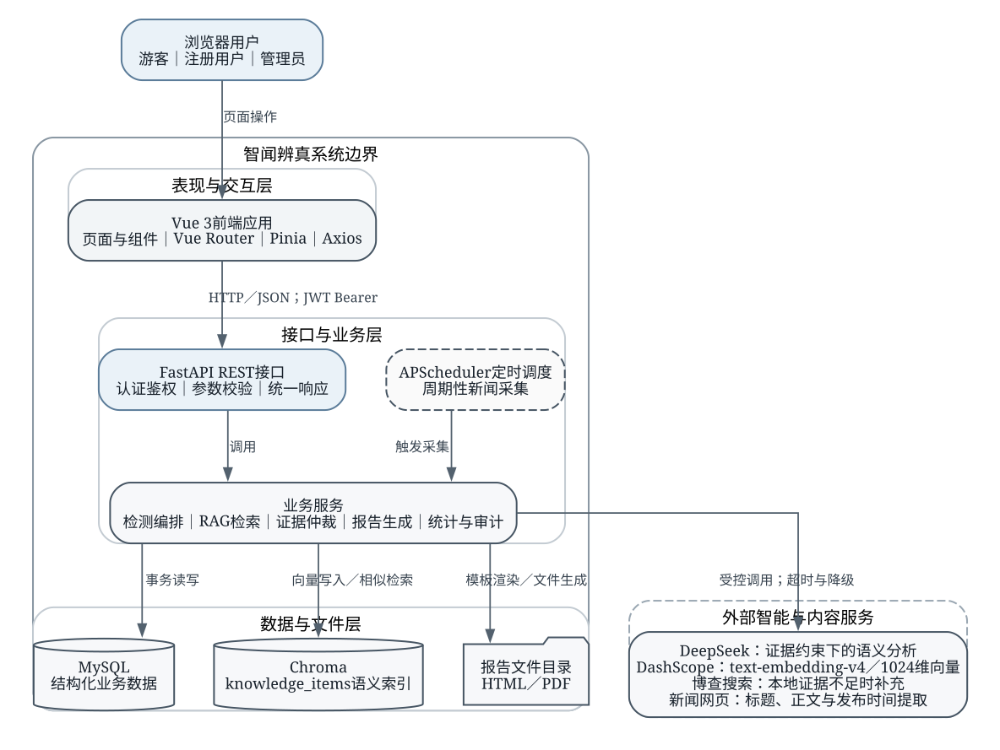
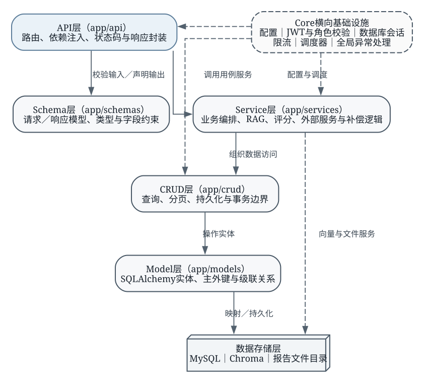
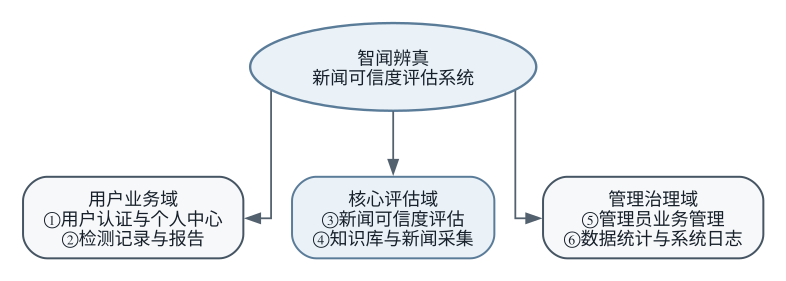
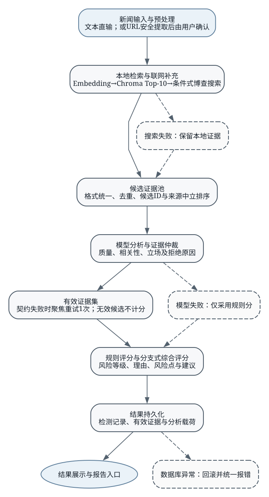
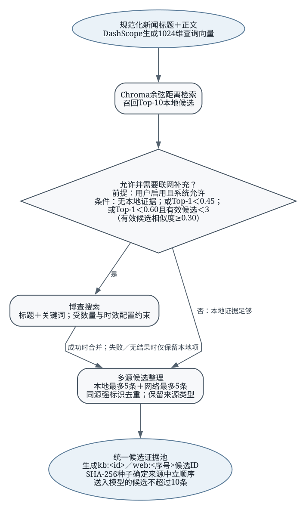
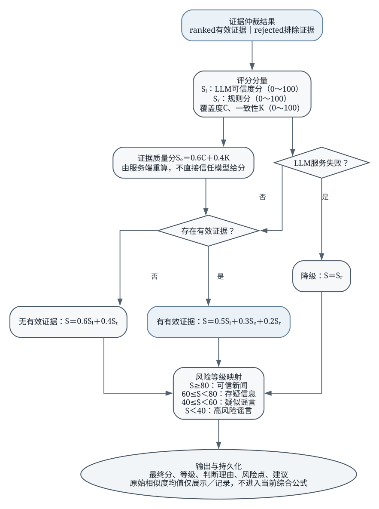
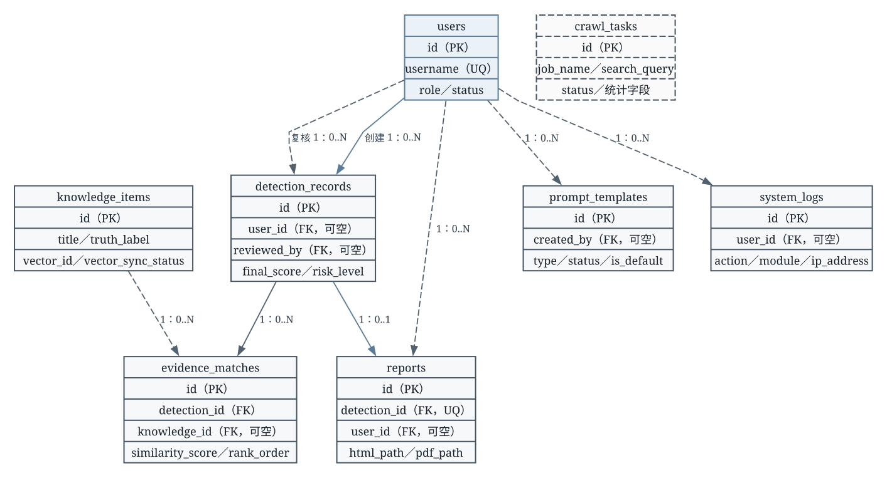
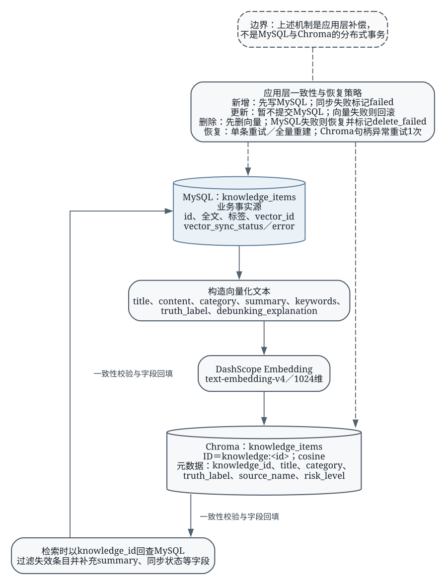
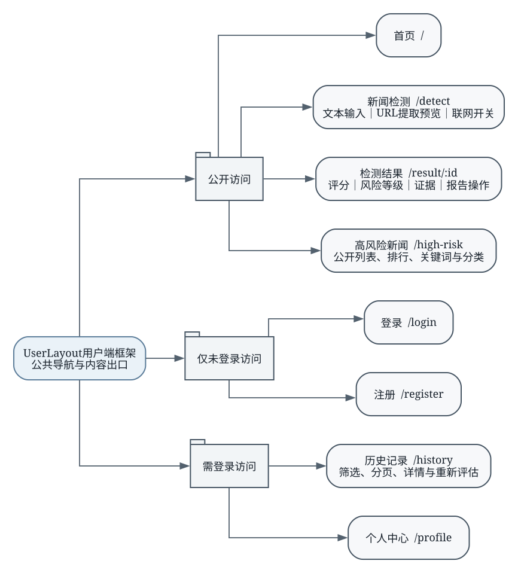
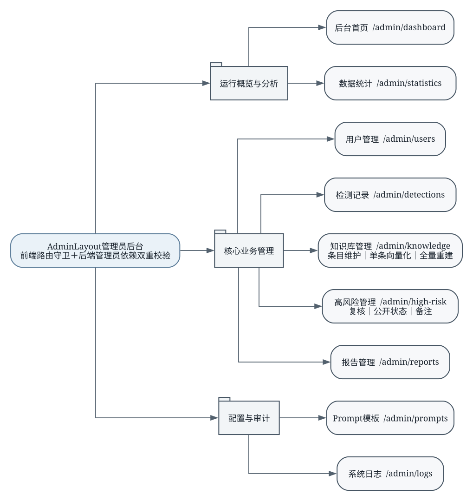

# 第4章 系统总体设计

本章在前述需求分析与技术选型的基础上，给出“智闻辨真”新闻可信度评估系统的总体设计。设计内容以当前项目代码、数据库模型、迁移文件、前后端路由和运行配置为事实依据，重点说明系统边界、模块协作、评估流程、数据组织、权限体系及异常恢复路径。与第3章侧重开发环境和技术选择不同，本章回答各类技术如何被组织为可运行系统；具体类、函数和关键代码将在第5章展开，测试环境与测试结果不在本章讨论。

## 4.1 系统设计目标与原则

### 4.1.1 系统设计目标

系统总体设计首先服务于新闻可信度评估这一核心业务。用户可以直接提交新闻标题和正文，也可以输入新闻URL，待系统提取网页内容后进行确认和修订。后端围绕待评估新闻组织本地语义检索、按需联网补充、证据仲裁、规则评分和大语言模型分析，最终输出可信度分值、风险等级、判断理由、风险点、建议及可追溯证据。登录用户还可以查询历史记录、重新评估并生成检测报告；管理员可以维护知识库和Prompt模板，复核高风险记录，管理用户、检测记录和报告，并查看统计信息与操作日志。

可解释性与可追溯性是本系统区别于单次大模型问答的主要设计目标。系统不把大语言模型生成的结论直接视为事实，而是先构造具有稳定候选标识的证据集合，再要求模型对每条候选证据给出相关性、质量、立场及取舍理由。服务端继续验证候选是否被完整仲裁、分值是否处于合法范围、证据质量字段是否齐全，只有通过契约校验并进入ranked集合的证据才会参与综合评分。检测记录同时保存候选证据、排除证据、仲裁状态、质量状态和分析契约版本，使后续复核能够还原当时的判断依据。

系统还需要控制外部服务不确定性对主流程的影响。联网搜索失败时保留本地检索结果继续分析；模型服务失败时不使用未经仲裁的检索候选，而是退化为确定性规则评分；MySQL与Chroma之间无法形成跨存储事务，因此通过同步状态、错误信息、回滚和补偿恢复降低不一致概率。上述目标使系统在课程设计规模下兼顾功能完整度、结果可解释性、配置可复现性和后续维护成本。

### 4.1.2 系统设计原则

系统采用前后端分离和模块化设计。Vue 3前端负责页面导航、表单交互、状态反馈和结果展示，FastAPI后端负责身份认证、业务规则、外部服务调用和数据持久化。前端不保存决定可信度等级的业务规则，后端也不耦合具体页面布局，从而避免评分逻辑随界面变化而分散。

数据职责分离原则体现在MySQL、Chroma和报告目录的分工上。MySQL是用户、知识条目、检测记录和审计信息的业务事实源；Chroma只承担由知识条目派生的语义索引；HTML与PDF报告保存到配置化文件目录，并在关系数据库中记录文件位置。检索命中向量后仍需根据knowledge_id回查MySQL，防止失效或孤立向量直接进入评估结果。

系统遵循最小权限原则。公开页面和公开接口只提供新闻检测入口与已公开的高风险信息；历史记录、报告和独立RAG检索要求登录；管理端路由要求管理员身份，后端再次通过管理员依赖校验角色，避免仅依赖前端菜单隐藏形成权限空洞。对游客开放的检测接口使用可选身份依赖：无令牌时允许评估并将user_id保存为空，有令牌时则绑定当前有效用户。

系统同时遵循可降级、可追溯和配置分离原则。外部模型、Embedding、联网搜索、数据库连接、向量目录和报告目录均通过环境变量配置；错误分支保留明确状态，而不是用默认成功结果掩盖异常；关键管理操作写入系统日志。对于跨MySQL与Chroma的写操作，项目明确采用应用层补偿而非宣称实现分布式事务，使系统能力边界与实际实现保持一致。

系统角色与核心功能权限如表4-1所示。游客权限仅覆盖公开信息和一次性检测，注册用户获得个人数据能力，管理员在普通用户能力之上使用独立管理接口。

表4-1 系统角色与功能权限表

| 功能 | 游客 | 注册用户 | 管理员 |
|---|---|---|---|
| 浏览首页与公开高风险信息 | 允许 | 允许 | 允许 |
| 提交新闻文本/URL预览与检测 | 允许，记录不绑定用户 | 允许，记录绑定本人 | 允许，记录绑定本人 |
| 查看个人历史、详情与重新评估 | 不允许 | 仅本人 | 可使用个人功能；另有全局管理接口 |
| 生成/下载个人检测报告 | 不允许 | 仅本人记录 | 可使用个人功能；管理端可查看全局报告 |
| 独立RAG知识检索 | 不允许 | 允许 | 允许 |
| 用户、检测、知识、Prompt、高风险管理 | 不允许 | 不允许 | 允许 |
| 统计分析与系统日志 | 不允许 | 不允许 | 允许 |

## 4.2 系统总体架构设计

### 4.2.1 系统总体架构

系统采用浏览器/服务器（Browser/Server，B/S）架构，整体由浏览器用户、Vue 3前端、FastAPI后端、业务服务、数据与文件存储以及外部智能服务组成。系统总体架构如图4-1所示。

浏览器中的游客、注册用户和管理员通过同一前端应用访问不同功能。Vue Router根据路由元信息控制公开页面、登录页面和管理页面，Pinia保存用户会话状态，Axios负责向“/api”前缀下的REST接口发送JSON请求。FastAPI接收请求后完成参数校验、身份依赖解析和统一异常处理，再把具体业务交给服务层。

后端业务服务覆盖检测编排、知识库语义检索、DeepSeek分析、证据仲裁、规则与综合评分、报告生成、统计和系统日志。MySQL保存结构化业务记录，Chroma保存knowledge_items集合的向量索引，报告目录保存生成的HTML和PDF文件。外部服务包括DeepSeek对话模型、DashScope Embedding、博查搜索及新闻网页内容源。APScheduler随应用生命周期启动，在配置允许且外部搜索凭据可用时触发周期性新闻采集。该架构将确定性业务数据、派生语义索引和外部智能能力分开，为异常定位和局部替换提供了清晰边界。

### 4.2.2 前后端交互架构

前端页面通过Axios访问后端REST接口。开发环境由Vite把“/api”请求代理到后端，生产环境的接口基础地址由配置决定。请求和响应主要使用JSON；报告下载属于文件响应。后端成功响应统一包含code、message和data三个字段，HTTP异常、参数校验异常与数据库异常也被转换为相同外层结构，前端可以集中处理成功提示、字段错误、未登录跳转和权限不足提示。

登录成功后，后端签发包含用户标识、角色和过期时间的JWT访问令牌。前端把令牌附加到Authorization请求头，后端以Bearer方式解析。前端路由守卫只用于改善导航体验，真正的访问控制仍由后端依赖完成：普通登录接口使用get_current_user，管理接口使用get_current_admin，游客检测使用get_optional_current_user。这样既支持游客快速评估，又避免管理接口因前端状态被篡改而越权。

新闻URL输入采用“提取预览—人工确认—提交检测”的两阶段交互。提取预览接口只返回规范化后的标题、正文、发布时间和来源信息，不直接启动检测或写入检测记录。用户确认后，前端再提交最终文本。该设计既允许系统利用网页抽取减少复制成本，也把网页结构解析误差暴露给用户修订，降低错误正文直接进入后续模型分析的概率。

### 4.2.3 后端分层架构

后端按真实目录划分为API、Schema、Service、CRUD、Model和Core等层次，其依赖关系如图4-2所示。

API层位于app/api，负责定义路由、注入数据库会话和身份依赖、解释查询参数并组织HTTP响应。Schema层位于app/schemas，以Pydantic模型约束标题、正文、分页参数、枚举值和响应结构。Service层位于app/services，是业务复杂度的主要承载位置，包括检测主流程、证据仲裁、知识库同步、报告生成、统计和外部服务适配。CRUD层集中封装SQLAlchemy查询、分页和持久化操作；Model层定义表、主外键、唯一约束和级联关系。

Core层提供横向基础能力，包括环境配置、JWT、数据库会话、角色依赖、内存滑动窗口限流、APScheduler初始化和全局异常处理。Chroma和报告文件并不通过SQLAlchemy模型访问，而由Service层的专门服务封装。总体依赖方向由上层用例向下层数据能力推进，API层不直接编写复杂SQL，CRUD层也不负责模型调用和业务决策，从而把接口变化、业务变化和数据结构变化控制在不同层次。

### 4.2.4 数据存储与智能服务架构

MySQL承担系统的结构化事实存储，包括用户、知识条目、检测记录、有效证据、Prompt模板、报告、系统日志和采集任务。Chroma中的向量、文档和元数据均由知识条目派生，不作为独立业务事实源。知识新增或修改后，系统构造包含标题、正文、类别、摘要、关键词、真伪标签和辟谣说明的文本，调用DashScope的text-embedding-v4生成1024维向量，再以knowledge:<id>作为向量文档标识写入knowledge_items集合。

DeepSeek在系统中的职责是受候选证据约束的语义分析，而非替代数据库或直接决定最终等级。系统向其提供规范化新闻和候选证据，要求返回新闻可信度分量、理由、风险点、建议、证据质量以及逐条仲裁结果。博查搜索只在本地证据不足且用户允许联网时补充候选信息，失败不阻断本地RAG路径。新闻网页则由受限抓取器提取内容，抓取结果须经用户确认后才进入检测。上述分工使模型生成、语义召回和结构化持久化各自承担单一职责。

## 4.3 系统功能模块设计

系统功能由六个相互协作的模块组成，模块关系如图4-3所示。

表4-2概括各模块的服务对象、输入、主要处理和输出。模块划分覆盖用户端评估、管理端治理、数据统计与审计，也保留了知识持续更新和向量恢复路径，能够反映项目从单一模型调用扩展为完整Web系统的实际工作量。

表4-2 系统主要功能模块说明表

| 功能模块 | 服务对象与输入 | 主要处理 | 主要输出 |
|---|---|---|---|
| 用户认证与个人中心 | 游客、注册用户；账号、密码与会话令牌 | 注册、登录、令牌校验、账户状态检查、会话恢复 | 用户信息、访问令牌、个人页面状态 |
| 新闻可信度评估 | 游客和用户；新闻文本或URL确认文本 | 语义检索、联网补充、证据仲裁、规则与综合评分 | 分值、等级、理由、风险点、建议和证据 |
| 检测记录与报告 | 登录用户；记录ID、筛选条件 | 历史查询、详情、重新评估、模板渲染和PDF生成 | 检测历史、详情、HTML/PDF报告 |
| 知识库与新闻采集 | 管理员、调度器；知识条目或采集配置 | 条目维护、Embedding、Chroma同步、单条重试、全量重建、定时采集 | 知识记录、同步状态、采集任务记录 |
| 管理员业务管理 | 管理员；管理筛选和操作请求 | 用户启停、检测管理、Prompt管理、高风险复核与公开控制 | 管理列表、详情和操作结果 |
| 数据统计与系统日志 | 管理员；时间范围和统计维度 | 聚合趋势、分布、关键词、活跃度并记录管理行为 | 统计数据、审计日志 |

### 4.3.1 用户认证与个人中心模块

该模块面向游客和注册用户。注册输入包括用户名、密码和可选邮箱，服务端完成字段校验、重复性检查和bcrypt密码哈希；登录时验证密码、账户状态并签发JWT。个人中心和历史记录要求有效登录状态，前端恢复本地会话后仍会请求当前用户接口确认令牌有效性，避免仅凭本地缓存判断身份。

模块输出包括当前用户基本信息、角色、状态和访问令牌。它向新闻检测模块提供可选用户身份，向历史和报告模块提供强制用户身份，并向管理端提供角色基础。账户被禁用后，即使已有令牌尚未过期，后端依赖仍会根据数据库中的status拒绝访问。

### 4.3.2 新闻可信度评估模块

该模块是系统核心，输入为标题、正文、来源、发布时间和是否允许联网搜索等信息。主要处理包括文本清洗、关键词提取、Chroma召回、本地证据充分性判断、博查补充、多源候选整理、DeepSeek分析、证据契约校验、规则评分、综合评分和风险等级映射。输出不仅包含最终结论，还包含构成结论的有效证据、模型理由、规则命中项和降级状态。

该模块与知识库模块共享向量检索能力，与Prompt模块读取当前默认模板，与记录模块共同完成持久化，与高风险模块共享风险等级与高风险标识。其创新点集中体现在“先仲裁、后计分”的证据治理、来源中立的候选顺序、服务端重算证据质量分和按证据可用性切换的分支式评分。

### 4.3.3 检测记录与报告模块

检测完成后，系统保存输入快照、各评分分量、最终等级、分析载荷和有效证据。登录用户可以按分页条件查询自己的历史记录，查看详情、删除记录或在保留原始输入的基础上重新评估。游客检测记录的user_id为空，不进入登录用户的个人历史；游客结果页用于承接当次检测数据，持久化详情接口仍要求登录身份。

报告模块以检测记录为输入，通过Jinja2模板生成HTML，再调用xhtml2pdf生成PDF。reports表对detection_id设置唯一约束，使一条检测记录最多对应一条报告记录。报告生成与检测结果展示相互独立，PDF生成失败不会改变既有检测结论，用户仍可以查看页面结果。

### 4.3.4 知识库与新闻采集模块

知识库模块面向管理员，负责知识条目的新增、查询、修改、删除、单条向量化和全量索引重建。每条知识记录同时保存vector_id、vector_sync_status和vector_sync_error，用于表明派生向量的同步状态。检索返回Chroma候选后，服务端依据knowledge_id重新读取MySQL条目并补充摘要和同步状态，防止向量元数据替代业务数据。

新闻采集由APScheduler和news_crawler服务执行。调度器根据环境配置注册周期任务，博查搜索获取候选网页，安全抓取器提取正文，服务完成重复检查、知识条目创建和可选向量化，并把执行统计写入crawl_tasks。当前项目没有采集任务前端页面，也没有采集任务REST接口，因此本章只把它作为后台调度能力描述，不虚构人工管理入口。

### 4.3.5 管理员业务管理模块

管理员模块覆盖用户、检测记录、知识库、Prompt模板、高风险新闻和报告管理。用户管理支持列表查询、用户启用和禁用，后端还保留角色更新接口；检测管理支持全局记录筛选、详情和删除；Prompt管理支持新增、修改、启停和设置默认模板；高风险管理支持复核状态、是否公开和管理员备注维护；报告管理支持列表与详情查询。

所有管理接口统一依赖get_current_admin。前端AdminLayout和路由守卫用于限制页面入口，后端角色校验构成最终安全边界。管理员操作与系统日志服务联动，以用户标识、动作、模块、描述和IP地址形成审计记录。

### 4.3.6 数据统计与系统日志模块

统计模块基于MySQL业务记录提供检测概览、时间趋势、风险等级分布、类别分布、关键词统计、用户活跃度、知识库概览和向量同步状态分布。前端使用ECharts呈现这些聚合结果，统计接口只返回图表所需数据，不在后端生成截图。

系统日志模块记录关键管理行为，支持按动作、模块、用户和时间等条件分页查询。统计反映系统业务数据的总体状态，日志提供具体操作轨迹，两者共同服务于管理复核和问题定位，但不替代应用运行日志和外部服务监控。

## 4.4 新闻可信度评估流程设计

新闻可信度评估主流程如图4-4所示。该流程把检索增强生成（Retrieval-Augmented Generation，RAG）的知识准备、检索和生成环节[10]落实为可验证的候选证据管线，并针对大语言模型幻觉风险[12]增加证据契约、服务端质量重算和确定性降级。

### 4.4.1 新闻输入与文本规范化处理

用户可以手工输入新闻，也可以先调用提取预览接口处理URL。URL抓取只允许HTTP和HTTPS协议，默认拒绝指向本机、私有地址、链路本地地址及其他保留地址的目标；重定向由服务手动跟随，并在每一跳重新进行主机解析与地址检查，以降低服务端请求伪造风险。抓取设置超时时间，解析后返回标题、正文、发布时间和最终来源地址。用户可在检测页修改提取内容，再提交正式评估。

正式检测入口对标题和正文执行统一清洗，标题截取到255字符，正文截取到12000字符，任一为空则拒绝进入后续流程。清洗后的标题和正文用于关键词提取、RAG查询和模型分析；来源、发布时间和URL作为辅助元数据保存。该入口同时应用滑动窗口限流，游客以请求来源标识、登录用户以身份信息参与限流键构造，减少网页抓取和模型调用被高频滥用的风险。

### 4.4.2 本地知识库证据召回

本地召回先把标题和正文拼接为查询文本，并限制查询文本长度。DashScope Embedding把查询转换为1024维向量，Chroma在knowledge_items集合中按余弦距离检索Top-10候选。检索结果包含向量ID、文档、元数据和距离，服务端按“1－距离”转换为相似度，并根据元数据中的knowledge_id回查MySQL。

回查过程会跳过数据库中已不存在的条目，并以MySQL当前值覆盖标题、摘要、类别、真伪标签、来源、风险等级和同步状态。由此，Chroma负责快速发现语义邻近项，MySQL负责确认条目仍然有效。该二次校验增加了一次关系库查询，但避免索引残留直接污染证据池。

### 4.4.3 证据不足判定与联网补充

本地检索与联网补充流程如图4-5所示。

联网搜索必须同时满足系统全局开关允许和用户在本次请求中启用。满足前提后，出现以下任一情况即触发补充：本地没有证据；Top-1相似度低于0.45；或者Top-1相似度低于0.60且相似度不低于0.30的“有效候选”少于3条。第一条规则处理知识库完全未覆盖的新闻，第二条处理最高命中仍明显偏弱的情况，第三条处理只有少量中等相关候选、证据面不足的情况。

博查搜索查询由标题和已提取关键词组成，结果数量和时效范围由环境配置控制。服务异常、超时或无结果时，检测流程保留本地候选继续执行，不把联网能力作为强制依赖。web_triggered和网络证据数量等信息随分析载荷保存，便于区分“未触发搜索”和“触发后未得到可用证据”。

### 4.4.4 多源候选证据整理

本地候选和网络候选首先映射为统一证据结构，保留标题、摘要或片段、来源名称、来源URL、发布时间、来源类型和相似度等字段。合并时本地最多保留5条，网络最多保留5条；同一来源内部按稳定标识进行去重，不对不同来源的相似标题做强制跨源合并，以免把独立报道错误折叠为同一条证据。

每条候选随后获得稳定candidate_id：知识库证据使用kb:<knowledge_id>形式，网络证据使用web:<序号>形式。系统以新闻标题和正文构造种子，通过SHA-256得到可复现的来源中立顺序，再截取不超过10条候选送入模型。该设计避免始终把知识库或网络证据排在前面造成位置偏差，也使相同输入下的候选顺序可重现。原始候选列表仍被保存，模型输入上限不会导致审计信息丢失。

### 4.4.5 大语言模型证据分析与仲裁

DeepSeek接收新闻文本、统一候选证据和当前默认Prompt模板，输出新闻可信度分量、理由、风险点、关键词、建议、证据质量和证据仲裁。仲裁的ranked项必须包含candidate_id、相关性分、质量分、立场和理由；立场限定为support、contradict或neutral。rejected项包含candidate_id和排除原因。服务端要求ranked与rejected共同构成候选ID的完整、不重复划分，并检查分值、枚举和字段类型。

如果首次输出缺少仲裁对象、候选ID不完整、存在重复或证据质量字段无效，系统发起一次只聚焦证据仲裁的重试。重试通过后采用新的仲裁和质量数据；仍未通过时把状态标记为retry_exhausted，不让未完成仲裁的候选影响评分。证据质量包含覆盖度C、一致性K和说明，服务端不信任模型直接给出的总分，而是按0.6C＋0.4K重新计算证据质量分。该机制把生成式输出转化为可验证的数据契约，是本系统可解释评估链路的核心设计。

### 4.4.6 可信度评分与风险等级判定

评分与风险分级流程如图4-6所示。

设大语言模型可信度分为S_L，确定性规则分为S_R，证据质量分为S_E，三者范围均规范到0～100。S_E由证据覆盖度C与一致性K按式（4-1）计算：

S_E=0.6C+0.4K　　　　　　　　　　　　　　　（4-1）

当前主流程采用分支式综合评分，而不是对所有请求套用固定权重。若模型服务失败，由于检索候选尚未获得可信仲裁，最终分仅取规则分，如式（4-2）所示：

S=S_R　　　　　　　　　　　　　　　　　　　（4-2）

若模型可用但没有有效证据，最终分由模型分和规则分组成，如式（4-3）所示：

S=0.6S_L+0.4S_R　　　　　　　　　　　　　　（4-3）

若存在通过仲裁的有效证据，则使用式（4-4）：

S=0.5S_L+0.3S_E+0.2S_R　　　　　　　　　　　（4-4）

规则分以100分为基准，根据可解释规则扣分：标题或正文出现夸张词扣15分，缺少来源扣20分，情绪化词语扣15分，绝对化表达扣15分；在有效证据Top-5中发现相似度不低于0.70且立场冲突的内容时扣25分，最低为0分。检索相似度均值仍计算并保存为evidence_score，用于展示和诊断，但不进入当前综合公式，避免把语义相似直接等同于事实可信。

最终分S按统一阈值映射：S≥80为“可信新闻”，60≤S＜80为“存疑信息”，40≤S＜60为“疑似谣言”，S＜40为“高风险谣言”。高风险标识同时依据分值低于40或等级为高风险谣言确定。该阈值函数被检测结果、高风险列表和管理复核共同使用，避免不同模块各自判断产生等级漂移。

### 4.4.7 异常降级与评估结果保存

联网搜索异常时系统继续使用本地候选；模型初次返回不满足证据契约时聚焦重试一次；模型服务整体失败时只使用规则分，并在理由和风险点中标记模型服务异常。Chroma操作会清理缓存的客户端和集合句柄后重试一次，但检索或写入仍失败时由服务抛出可识别异常，接口转换为统一错误响应。数据库写入失败时回滚当前会话，不返回伪成功结果。

评估成功后，detection_records保存输入快照、evidence_score、llm_score、rule_score、final_score、风险等级、判断结果、理由、风险点、建议和高风险标识。analysis_payload进一步保存候选证据、排除证据、相似新闻、证据质量、仲裁状态、质量状态、错误摘要、尝试次数、契约版本及本地/网络有效命中标识。evidence_matches只保存最终有效证据，并以rank_order记录仲裁后的顺序。这样的持久化粒度既支持用户展示，也为管理员复核和算法迭代保留了上下文。

## 4.5 数据库设计

### 4.5.1 数据需求分析

系统数据可以分为身份权限数据、知识数据、评估过程数据、配置数据、报告文件索引、审计数据和采集运行数据。身份权限数据回答谁可以访问何种功能；知识数据为RAG提供可维护事实材料；评估数据记录输入、分量、结论和证据；Prompt模板控制模型输出契约；报告表关联生成文件；系统日志记录管理行为；采集任务记录后台调度的数量和状态。

由于语义检索数据由知识条目派生，系统还需要保存向量ID、同步状态和同步错误。此类字段不是业务内容本身，却是判断MySQL与Chroma是否一致的重要运维数据。数据设计因此同时考虑业务查询、级联删除、可空关系和跨存储补偿，而不只保存最终评分。

### 4.5.2 数据实体及关系设计

系统真实实体及关系如图4-7所示。

users与detection_records存在两类一对多关系：用户可以创建多条检测记录，管理员也可以复核多条记录；user_id和reviewed_by均允许为空，并在用户删除时置空，以保留业务历史。detection_records与evidence_matches是一对多关系，删除检测记录时证据级联删除。evidence_matches到knowledge_items的外键允许为空，知识条目删除后将knowledge_id置空，但证据标题、摘要、来源和相似度快照仍可保留。

detection_records与reports是一对零或一关系，reports.detection_id具有唯一约束，检测删除时报告记录级联删除。users与reports、prompt_templates、system_logs均为一对多可空关系，用户删除时外键置空。crawl_tasks记录调度执行结果，不与用户或知识条目建立强外键，避免单次采集统计因后续知识维护而失真。

### 4.5.3 关系数据库表结构设计

核心关系表如表4-3所示。表中仅列出决定实体职责和关系的关键字段，时间戳、一般描述字段和全部索引细节留待第5章结合模型实现说明。

表4-3 核心数据表说明

| 表名 | 主键 | 关键外键/约束 | 关键业务字段 | 主要职责 |
|---|---|---|---|---|
| users | id | username、email唯一 | password_hash、role、status | 保存账号、角色和账户状态 |
| knowledge_items | id | 无强外键 | title、content、truth_label、source、vector_id、vector_sync_status | 保存知识事实及向量同步状态 |
| detection_records | id | user_id、reviewed_by→users，可空 | 输入快照、三类分量、final_score、risk_level、analysis_payload | 保存完整评估结果与复核状态 |
| evidence_matches | id | detection_id→detection_records；knowledge_id→knowledge_items，可空 | title、summary、source_name、similarity_score、rank_order | 保存参与最终判断的有效证据快照 |
| prompt_templates | id | created_by→users，可空 | name、type、content、is_default、status | 管理模型提示模板和默认模板 |
| reports | id | detection_id唯一；user_id可空 | title、html_path、pdf_path | 关联检测记录与生成文件 |
| system_logs | id | user_id→users，可空 | action、module、description、ip_address | 保存管理操作审计信息 |
| crawl_tasks | id | 无强外键 | job_name、search_query、数量统计、started_at、finished_at、status | 保存定时采集任务执行摘要 |

### 4.5.4 Chroma集合与向量元数据设计

Chroma集合名称为knowledge_items，距离空间设置为cosine。每条向量文档ID采用knowledge:<item.id>，使向量可由关系库主键稳定定位。文档文本由title、content、category、summary、keywords、truth_label和debunking_explanation按字段标签拼接，长度由服务限制。正式配置使用DashScope text-embedding-v4，向量维度为1024。

Chroma原生元数据只保存knowledge_id、title、category、truth_label、source_name和risk_level，均为检索过滤或结果初步展示需要的轻量字段。vector_sync_status不写入Chroma元数据，而保存在MySQL；检索回查后才加入返回结果。该设计避免同步状态自身又成为需要双向同步的数据。向量查询返回distance后转换为similarity_score，类别、真伪标签和风险等级可作为where过滤条件。

### 4.5.5 MySQL与Chroma数据一致性设计

MySQL与Chroma协同关系如图4-8所示。

新增知识条目时系统先提交MySQL，再生成Embedding并写入Chroma；向量同步失败时保留知识条目，将vector_sync_status标记为failed并记录错误，便于管理员单条重试。更新知识条目时，MySQL修改暂不提交，服务先执行向量upsert；向量失败则回滚关系库修改，成功后再统一提交，从而使内容与索引尽量同时切换。

删除采用“先删向量、再删MySQL”。若向量删除失败，关系记录保留并标记失败；若向量已删除而MySQL删除失败，服务回滚数据库会话并尝试恢复原向量，再把状态标记为delete_failed。管理接口还提供单条重新向量化与全量重建集合。Chroma客户端或集合句柄异常时，服务清除缓存句柄并重试一次。

这些策略属于应用层顺序控制和补偿，不是MySQL与Chroma的分布式事务。极端情况下仍可能需要管理员依据vector_sync_status和vector_sync_error执行单条重试或全量重建。明确这一边界比笼统宣称“强一致”更符合当前实现，也为后续引入异步补偿队列或软删除机制保留了演进方向。

## 4.6 接口与权限体系设计

### 4.6.1 接口设计原则

系统接口按业务资源分组，统一使用“/api”前缀。列表接口采用page、page_size和业务筛选参数，详情接口使用资源ID，修改类接口使用明确的POST、PUT、PATCH或DELETE语义。请求体由Pydantic模型校验，返回体以code、message和data封装；文件下载接口根据资源权限返回实际文件响应。接口层只组织HTTP语义，评分和同步逻辑放在Service层，避免相同规则在用户接口和管理员接口重复实现。

公开、登录和管理员接口在路由层明确区分。检测与URL提取预览允许可选登录，高风险公开列表与系统健康检查不要求令牌；历史、详情、重新评估、RAG搜索和报告生成要求登录；所有/admin接口要求管理员。采集任务目前由调度器根据配置执行，没有对外REST接口，本章不将crawl_tasks误列为可人工调用的接口资源。

### 4.6.2 系统接口分类

系统主要接口分类如表4-4所示。

表4-4 系统接口分类表

| 接口类别 | 典型前缀/资源 | 访问要求 | 主要职责 |
|---|---|---|---|
| 认证接口 | /auth | 注册、登录公开；/me需登录 | 注册、登录、获取当前用户 |
| 新闻检测接口 | /detect | 新闻检测和提取预览可选登录；历史、详情、重评需登录 | 提交评估、URL预览、历史与详情 |
| RAG检索接口 | /rag | 登录 | 独立查询知识库相似条目 |
| 报告接口 | /report | 登录且校验记录归属 | 生成和下载检测报告 |
| 高风险公开接口 | /high-risk | 公开 | 已公开高风险列表、排行、关键词和分类 |
| 管理业务接口 | /admin/users、/admin/detections、/admin/high-risk | 管理员 | 用户、检测和高风险复核管理 |
| 知识与Prompt接口 | /admin/knowledge、/admin/prompts | 管理员 | 知识维护、向量恢复和模板管理 |
| 统计、报告与日志接口 | /admin/statistics、/admin/reports、/admin/logs | 管理员 | 统计聚合、报告查看和日志审计 |
| 健康检查接口 | /health | 公开 | 返回服务运行状态和版本信息 |

### 4.6.3 身份认证设计

用户登录时，服务端以bcrypt验证明文密码与password_hash，校验账户为active后生成JWT。令牌至少包含sub和exp，并附带role及用户名信息；签名密钥、算法和过期分钟数来自环境配置。受保护接口通过OAuth2PasswordBearer读取Authorization头，解码令牌后仍按sub查询数据库用户，以确认用户存在且未被禁用。

可选身份依赖在请求没有Authorization头时返回空用户；如果请求主动携带了格式错误、无效或已禁用用户的令牌，则返回401，而不是静默降级为游客。这一规则避免登录状态异常时产生归属不清的检测记录。前端会话恢复成功后才把用户视为已验证，路由守卫据此决定登录页、个人页和管理页跳转。

### 4.6.4 角色权限控制设计

系统角色与功能权限见表4-1。权限矩阵不仅区分页面入口，还对应后端依赖和资源归属校验。

前端对/admin父路由及其子路由同时设置requiresAuth和requiresAdmin，后端所有管理路由再次依赖get_current_admin。公开高风险页面只展示is_public条件下的数据，审核状态、管理员备注和未公开记录留在管理接口。游客结果页可承接当次检测返回的数据，但需要持久化历史、详情或报告能力时必须登录，这一访问边界与后端接口保持一致。

### 4.6.5 统一响应与异常处理设计

普通JSON成功响应为{code, message, data}，其中code与预期HTTP语义一致。HTTPException由全局处理器保留状态码并转换detail；Pydantic请求校验异常统一返回422，并把字段位置和错误信息拼接为可读消息；SQLAlchemy异常返回500和数据库配置或操作提示。服务层可识别异常在API层映射为400、404、409、422或503等状态，避免所有错误都返回200。

前端响应拦截器可依据HTTP状态和统一message给出提示，并在401时清理失效会话。统一外层结构不意味着抹平错误类型：模型服务异常、向量同步异常、资源不存在、权限不足和参数错误仍通过状态码及消息区分。报告下载属于二进制响应，不强行套用JSON结构。

## 4.7 系统安全性与可靠性设计

系统安全性与可靠性措施如表4-5所示。

表4-5 系统安全性与可靠性设计表

| 设计对象 | 已实现措施 | 主要作用与边界 |
|---|---|---|
| 身份与密码 | JWT、bcrypt、账户状态复查、管理员依赖 | 限制受保护资源访问；令牌安全仍依赖密钥保管和HTTPS部署 |
| 输入与接口 | Pydantic校验、文本清洗、长度限制、滑动窗口限流、CORS配置 | 降低非法参数和高频调用风险；当前限流为进程内实现 |
| 数据访问 | SQLAlchemy参数化查询、会话回滚、外键与唯一约束 | 降低注入与部分写入风险；需配合最小数据库权限 |
| URL抓取 | 仅HTTP/HTTPS、私有/保留地址阻断、逐跳重定向校验、超时 | 降低SSRF和长时间占用风险；不能替代网络层出口控制 |
| 外部智能服务 | API密钥环境变量、超时、结构校验、仲裁重试和降级 | 减少外部失败扩散；模型结论仍需人工复核 |
| 双存储一致性 | 同步状态、错误记录、回滚、向量恢复、单条/全量重建 | 提供异常恢复路径；不是分布式强一致事务 |
| 审计与文件 | 管理操作日志、配置化报告目录、数据库保存文件索引 | 支持追踪与文件定位；目录权限由部署环境保证 |

### 4.7.1 用户输入与接口访问安全

账号、分页、枚举和检测请求由Schema层进行类型与范围校验，文本进入业务前使用统一清洗函数处理。SQLAlchemy通过表达式和绑定参数访问数据库，业务代码不拼接用户输入生成SQL。注册、登录、新闻检测和URL预览使用进程内滑动窗口限流器，配置项控制时间窗口和请求数量。该实现适合当前单实例部署；若扩展为多进程或多节点，需要迁移到共享限流存储才能获得全局一致配额。

CORS允许来源由环境变量控制。当允许来源不是通配符时才开启凭据支持，避免通配来源与凭据组合。管理接口要求管理员角色，普通用户接口还会检查记录归属。系统不声称完全消除越权风险，但通过前端导航限制、后端依赖校验和资源级归属检查形成多层访问边界。

### 4.7.2 外部服务调用与敏感配置安全

数据库密码、JWT密钥、DeepSeek密钥、DashScope密钥和博查密钥均从.env读取，.env.example只提供配置项说明。代码和论文不保存真实凭据。外部调用设置超时并捕获HTTP、网络和JSON解析异常；URL抓取在解析初始地址和每次重定向时检查目标地址，减少由恶意URL访问内部网络的可能性。

模型响应需经过JSON提取、字段清洗、分值归一化和证据契约校验。即使模型返回了evidence_quality.score，服务端仍使用覆盖度与一致性重算；即使候选相似度较高，未完成仲裁也不进入评分。这些措施不能证明模型输出必然正确，但可以限制非结构化输出直接改变业务状态的范围。

### 4.7.3 数据一致性与故障降级设计

MySQL写操作使用会话提交和回滚，检测记录与有效证据在同一业务过程内保存。知识更新把数据库提交推迟到Chroma upsert成功之后；删除失败时尝试恢复向量并记录delete_failed。向量同步状态为pending、synced、failed或delete_failed，管理员可据此执行单条向量化或全量重建。

联网搜索是可选增强，失败时不影响本地证据路径；模型失败时使用规则分而不伪造证据质量；报告生成失败不改变检测记录。上述降级策略优先保证已确定数据不被外部故障破坏，同时在结果中暴露能力缺失。对于Chroma完全不可用或数据库不可用等核心依赖故障，系统返回明确错误而不是生成无依据结论。

### 4.7.4 系统日志与操作审计设计

system_logs保存操作者、动作、模块、描述、IP地址和时间。知识条目维护、Prompt变更、用户启停、高风险复核、报告和检测记录管理等操作可形成审计轨迹。管理员日志页支持筛选和分页，便于定位谁在何时修改了关键配置或业务数据。

检测过程自身的可追溯信息主要保存在detection_records.analysis_payload，而不是全部写入system_logs。前者记录算法上下文，后者记录管理行为，两者职责分离。应用运行日志仍由Python日志系统输出，用于记录外部服务异常、重试和补偿失败；生产环境可在此基础上接入集中日志平台，但当前项目未实现独立监控告警系统。

## 4.8 用户界面与交互设计

### 4.8.1 用户端界面结构设计

用户端真实页面结构如图4-9所示。

UserLayout提供公共导航和内容出口。首页、新闻检测、检测结果和高风险新闻为公开路由；登录和注册为guestOnly路由，已验证登录用户访问时会被重定向；历史记录和个人中心要求登录。新闻检测页同时提供文本输入和URL提取预览，用户可以控制是否允许联网搜索。结果页以评分卡、风险标签、判断理由、风险点、建议和证据列表组织信息，避免只呈现单一真假标签。

页面交互统一考虑加载、空数据和失败状态。检测期间显示步骤与加载反馈，防止用户重复提交；历史和高风险页面使用筛选与分页；证据列表按有效与排除语义组织；登录用户可从结果或历史进入报告生成。公开结果页只承担当次结果呈现，个人历史与持久化详情仍由登录权限保护。

### 4.8.2 管理员端界面结构设计

管理员端真实页面结构如图4-10所示。

AdminLayout下包含后台首页、用户管理、检测记录、知识库、Prompt模板、高风险管理、数据统计、报告管理和系统日志九个页面。后台首页与统计页负责概览和图表，核心业务页以筛选、表格、分页、详情和确认对话框为主，知识库页额外提供单条向量化和全量索引重建，高风险页提供复核、公开状态和管理员备注操作。

当前Vue Router中没有采集任务页面，因此图4-10不包含“采集任务管理”。采集状态只保存在crawl_tasks并由后台调度器写入。这样的如实划界能够避免论文界面设计与实际可访问页面不一致，也说明采集能力当前属于系统内部维护机制而非管理员交互功能。

### 4.8.3 核心业务交互流程设计

核心交互从新闻输入开始。手工模式下，用户填写标题、正文和可选来源；URL模式下，用户先请求提取预览，核对后再提交。前端在请求期间展示加载状态，成功后跳转结果页；失败时保留用户输入并展示后端message。结果页优先呈现最终分和风险等级，其后是判断理由、风险点、建议、有效证据和相似新闻，使用户先获得结论，再逐层查看依据。

登录用户可以从历史列表进入详情，或使用原输入重新评估。报告生成由用户主动触发，成功后提供下载入口。管理员在后台通过筛选定位记录或知识条目，危险操作使用确认交互；高风险记录可以先复核再决定是否公开；统计页把趋势、分布和关键词数据转换为图表。整个交互设计围绕“输入可修订、过程有反馈、结论有证据、管理可追踪”展开，并与后端权限和数据状态保持一致。

## 4.9 本章小结

本章依据项目真实实现完成了系统总体设计。系统以Vue 3与FastAPI构成前后端分离架构，以MySQL保存业务事实、Chroma维护知识语义索引，并通过DeepSeek、DashScope、博查搜索和新闻网页提取形成多源智能处理链路。功能上覆盖认证、新闻评估、记录与报告、知识与采集、管理治理、统计与审计六个模块。

新闻评估流程采用本地Top-10召回、条件式联网补充、候选证据稳定标识、来源中立排序、逐条证据仲裁、服务端证据质量重算和分支式综合评分。MySQL与Chroma通过同步状态、回滚、恢复和索引重建降低不一致风险，并明确其应用层补偿边界。接口、权限、安全和界面设计均与当前路由、模型和服务保持一致，为第5章的详细设计与实现提供了结构化依据。
